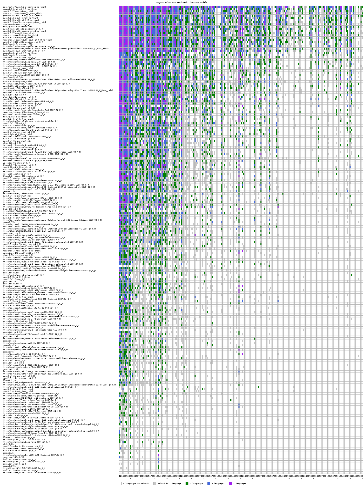
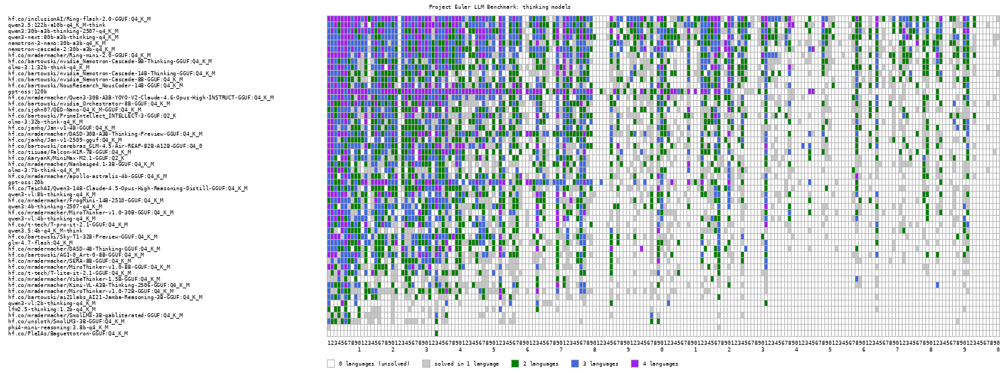

# Project Euler LLM Benchmark

To identify the performance of Large Language Models to solve problems with domain-specific knowledge (here: programming)
we created a benchmark using the Project Euler series of challenging mathematical/computer programming problems.
Because we want to apply LLMs for coding with specific programming languages, we also want to measure how good
a LLM is at coding with that given programming language.





## Super-Human Performance
AI systems have achieved domain-specific super-human performance. In 1997, IBM’s “Deep Blue” defeated world chess champion Garry Kasparov, marking the first time a machine outperformed the best human player. Since then, AI has surpassed human ability in many games, including Go, where AlphaGo triumphed in 2016.

While Deep Blue was “super-human” because it exceeded the best human, our goal is to define super-human performance relative to the average human score in the Project Euler test. This allows us to express an AI’s performance as a multiplier of human ability.

With the Project Euler LLM Benchmark, we aim to quantify how strongly LLMs demonstrate super-human capabilities in the domain of programming. See the Motivation chapter below for details on our measurement approach.

## Results for PE-Bench-200
The computed Benchmark ("PE-Bench-Python-200", "PE-Bench-Java-200", "PE-Bench-Rust-200", "PE-Bench-Clojure-200")  is the super-human performance factor to code in Python/Java/Rust/Clojure.
The "Economic Score" is the average performance per bytes of model size (times 100). Results are:

### Non-Thinking
| Model                                                                                            | Best<br/>Model<br/>for<br/>Size (GB) | PE-200-<br/>Score | Mem-<br/>Score | Size<br/>*10^9 Params | Bits | Context Length<br/>(K) | Python | Java | Rust | Clojure |
| :----------------------------------------------------------------------------------------------- | -----------------------------------: | ----------------: | -------------: | --------------------: | ---: | ---------------------: | -----: | ---: | ---: | ------: |
| openrouter/qwen3.6-plus:free-no_think                                                            |      794 |  78.66 |     10 |  397.0 |   16 | 1024 | 83.93 | 88.63 | 75.56 | 33.89 |
| gemma4:31b-it-q8_0-no_think                                                                      |    33.77 |  59.30 |    176 |   30.7 |    8 |  256 | 71.92 | 63.29 | 51.47 | 12.46 |
| gemma4:31b-it-q4_K_M-no_think                                                                    |    23.02 |  58.70 |    255 |   30.7 |    4 |  256 | 64.0 | 65.1 | 62.3 | 11.08 |
| gemma4:31b-mxfp8-no_think                                                                        |          |  58.45 |    173 |   30.7 |    8 |  256 | 68.0 | 64.77 | 55.03 | 8.09 |
| gemma4:31b-nvfp4-no_think                                                                        |    23.02 |  55.45 |    241 |   30.7 |    4 |  256 | 62.19 | 65.01 | 51.65 |  7.4 |
| gemma4:26b-a4b-it-q8_0-no_think                                                                  |          |  55.03 |    199 |   25.2 |    8 |  256 | 62.19 | 56.38 | 62.99 | 6.42 |
| qwen3.5:27b-nvfp4-no_think                                                                       |    20.25 |  53.75 |    265 |   27.0 |    4 |  256 | 66.05 | 61.25 | 42.64 | 4.29 |
| gemma4:26b-mxfp8-no_think                                                                        |          |  51.11 |    184 |   25.2 |    8 |  256 | 57.19 | 58.67 | 51.61 | 3.13 |
| qwen3.5:122b-a10b-q4_K_M-no_think                                                                |          |  49.13 |     54 |  122.0 |    4 |  256 | 56.16 | 49.91 | 52.0 | 12.89 |
| gemma4:26b-a4b-it-q4_K_M-no_think                                                                |    18.90 |  48.94 |    259 |   25.2 |    4 |  256 | 56.28 | 50.4 | 52.99 | 7.05 |
| qwen3.5:35b-a3b-mxfp8-no_think                                                                   |          |  48.64 |    126 |   35.0 |    8 |  256 | 60.31 | 51.69 | 42.46 | 5.17 |
| qwen3.6:35b-a3b-coding-mxfp8-no_think                                                            |          |  46.75 |    121 |   35.0 |    8 |  256 | 54.97 | 50.45 | 44.75 | 6.75 |
| qwen3.5:35b-a3b-q4_K_M-no_think                                                                  |          |  46.64 |    178 |   35.0 |    4 |  256 | 68.4 | 39.13 | 33.71 | 8.01 |
| qwen3.6:35b-a3b-mxfp8-no_think                                                                   |          |  45.76 |    119 |   35.0 |    8 |  256 | 55.47 | 52.89 | 33.7 | 9.65 |
| qwen3.6:35b-a3b-nvfp4-no_think                                                                   |          |  45.66 |    174 |   35.0 |    4 |  256 | 52.06 | 57.27 | 34.35 |  7.9 |
| qwen3.5:35b-a3b-coding-mxfp8-no_think                                                            |          |  45.57 |    118 |   35.0 |    8 |  256 | 55.85 | 50.17 | 39.47 | 2.83 |
| qwen3-coder-next:Q4_K_M                                                                          |          |  44.95 |     75 |   79.7 |    4 |  256 | 54.49 | 42.84 | 47.33 | 8.38 |
| qwen3.5:35b-a3b-q8_0-no_think                                                                    |          |  44.57 |    116 |   35.0 |    8 |  256 | 48.73 | 55.77 | 37.59 | 8.33 |
| frob/qwen3.5-instruct:35b                                                                        |          |  44.53 |    170 |   35.0 |    4 |  256 | 55.6 | 48.26 | 35.49 | 7.17 |
| qwen3.6:35b-a3b-q8_0-no_think                                                                    |          |  43.14 |    112 |   35.0 |    8 |  256 | 48.59 | 48.94 | 39.76 | 10.75 |
| frob/qwen3.5-instruct:122b                                                                       |          |  43.13 |     47 |  122.0 |    4 |  256 | 47.61 | 49.93 | 40.42 | 10.24 |
| qwen3.6:35b-a3b-coding-nvfp4-no_think                                                            |          |  42.87 |    163 |   35.0 |    4 |  256 | 55.2 | 45.44 | 31.44 | 8.67 |
| qwen3-next:80b-a3b-instruct-q4_K_M                                                               |          |  42.71 |     71 |   79.7 |    4 |  256 | 48.41 | 50.71 | 32.66 | 16.0 |
| qwen3.6:35b-a3b-q4_K_M-no_think                                                                  |          |  42.44 |    162 |   35.0 |    4 |  256 | 50.82 | 48.45 | 30.57 | 14.62 |
| qwen3.5:35b-a3b-coding-nvfp4-no_think                                                            |          |  42.28 |    161 |     35 |    4 |  256 | 58.53 | 39.28 | 33.06 | 4.72 |
| qwen3.5:27b-q4_K_M-no_think                                                                      |          |  41.98 |    207 |   27.0 |    4 |  256 | 45.09 | 55.69 | 32.6 | 7.21 |
| qwen3.5:35b-a3b-nvfp4-no_think                                                                   |          |  41.71 |    159 |     35 |    4 |  256 | 48.34 | 49.56 | 33.42 | 8.22 |
| gemma4:26b-nvfp4-no_think                                                                        |          |  41.30 |    149 |   25.2 |    8 |  256 | 43.5 | 51.38 | 39.34 | 6.18 |
| qwen3.5:27b-mxfp8-no_think                                                                       |          |  40.01 |    135 |   27.0 |    8 |  256 | 46.06 | 45.84 | 38.21 | 1.89 |
| nemotron-3-super:120b-a12b-q4_K_M-no_think                                                       |          |  38.78 |     43 |    120 |    4 | 1000 | 46.35 | 46.37 | 28.73 | 5.82 |
| qwen3-vl:235b-a22b-instruct-q4_K_M                                                               |          |  37.08 |     21 |  235.7 |    4 |  256 | 36.44 | 47.94 | 34.77 | 11.66 |
| frob/qwen3.5-instruct:27b                                                                        |          |  36.63 |    181 |   27.0 |    4 |  256 | 48.5 | 38.95 | 26.39 | 2.69 |
| qwen3:235b-a22b-instruct-2507-q4_K_M                                                             |          |  36.33 |     21 |  235.1 |    4 |  256 | 43.09 | 41.18 | 28.46 | 10.53 |
| qwen3.5:27b-q8_0-no_think                                                                        |          |  35.77 |    120 |   27.0 |    8 |  256 | 40.4 | 40.97 | 35.03 | 3.14 |
| hf.co/inclusionAI/Ling-flash-2.0-GGUF:Q4_K_M                                                     |          |  33.29 |     43 |    103 |    4 |  128 | 42.38 | 34.36 | 23.3 | 13.74 |
| hf.co/mradermacher/Qwen3.5-27B-Claude-4.6-Opus-Reasoning-Distilled-i1-GGUF:Q4_K_M-no_think       |          |  27.86 |    133 |     28 |    4 |  256 | 28.18 | 32.16 | 30.87 | 7.68 |
| qwen3.5:9b-mxfp8-no_think                                                                        |     9.90 |  25.90 |    262 |    9.0 |    8 |  256 | 30.42 | 30.57 | 21.49 | 2.63 |
| frob/qwen3.5-instruct:9b                                                                         |     6.75 |  21.12 |    313 |      9 |    4 |  256 | 32.51 | 17.72 | 13.29 | 1.45 |
| qwen3-vl:32b-instruct-q4_K_M                                                                     |          |  20.56 |     82 |   33.4 |    4 |  256 | 27.78 | 21.15 | 13.91 | 3.19 |
| hf.co/cturan/IQuest-Coder-V1-40B-Instruct-GGUF:Q4_K_M                                            |          |  20.09 |     67 |   39.8 |    4 |  128 | 26.12 | 19.65 | 17.81 | 1.83 |
| hf.co/mradermacher/Ling-mini-2.0-GGUF:Q4_K_M                                                     |          |  20.00 |    167 |     16 |    4 |  128 | 26.89 | 19.74 | 15.66 | 1.91 |
| gemma4:e4b-nvfp4-no_think                                                                        |     6.00 |  19.67 |    328 |    8.0 |    4 |  256 | 19.7 | 27.1 | 17.96 | 0.72 |
| hf.co/mradermacher/Ling-mini-2.0-i1-GGUF:Q4_K_M                                                  |          |  19.36 |    161 |     16 |    4 |  128 | 29.58 | 20.74 | 6.35 | 0.39 |
| gemma4:e4b-mxfp8-no_think                                                                        |          |  18.95 |    215 |    8.0 |    8 |  256 | 23.16 | 20.54 | 17.31 | 0.64 |
| hf.co/mradermacher/OmniCoder-9B-i1-GGUF:Q4_K_M                                                   |          |  18.90 |    280 |      9 |    4 |  256 | 25.28 | 21.23 | 11.73 | 0.71 |
| qwen3.5:9b-q4_K_M-no_think                                                                       |          |  18.37 |    272 |    9.0 |    4 |  256 | 25.67 | 19.64 | 10.59 | 0.89 |
| qwen3-vl:30b-a3b-instruct-q8_0                                                                   |          |  17.61 |     51 |   31.1 |    8 |  256 | 18.64 | 20.51 | 18.53 | 2.98 |
| qwen3-vl:30b-a3b-instruct-q4_K_M                                                                 |          |  17.33 |     74 |   31.1 |    4 |  128 | 18.95 | 21.38 | 16.01 | 1.38 |
| qwen3:30b-a3b-instruct-2507-q4_K_M                                                               |          |  17.31 |     76 |   30.5 |    4 |  256 | 16.93 | 23.76 | 16.1 | 1.89 |
| hf.co/mradermacher/SERA-32B-GGUF:Q4_K_M                                                          |          |  16.32 |     68 |   32.0 |    4 |   32 | 18.68 | 21.48 | 11.48 | 1.09 |
| qwen/qwen3-vl-30b                                                                                |          |  15.45 |     66 |   31.1 |    4 |  128 | 18.98 | 19.02 | 9.83 | 1.88 |
| qwen3-coder:30b-a3b-q4_K_M                                                                       |          |  15.18 |     66 |   30.5 |    4 |  256 | 19.51 | 13.41 | 14.03 | 5.46 |
| hf.co/mradermacher/Huihui-Qwen3-Coder-30B-A3B-Instruct-abliterated-GGUF:Q4_K_M                   |          |  14.97 |     65 |   30.5 |    4 |  160 | 17.56 | 18.06 | 10.43 |  4.4 |
| qwen3.5:9b-nvfp4-no_think                                                                        |          |  14.88 |    220 |    9.0 |    4 |  256 | 12.42 | 26.32 | 9.44 | 1.27 |
| hf.co/unsloth/Qwen3-Coder-30B-A3B-Instruct-1M-GGUF:Q4_K_M                                        |          |  14.18 |     62 |   30.5 |    4 |  256 | 14.02 | 17.25 | 12.92 | 8.11 |
| qwen3:30b-a3b-q4_K_M-no_think                                                                    |          |  13.00 |     57 |   30.5 |    4 |   40 | 14.5 | 15.85 | 10.06 | 4.36 |
| qwen2.5vl:32b-q4_K_M                                                                             |          |  12.51 |     50 |   33.5 |    4 |  128 | 15.56 | 11.71 | 13.44 | 0.82 |
| hf.co/mradermacher/Qwen3.5-35B-A3B-Claude-4.6-Opus-Reasoning-Distilled-i1-GGUF:Q4_K_M-no_think   |          |  12.42 |     46 |     36 |    4 |  256 | 14.22 | 13.16 | 13.15 | 1.57 |
| devstral-2:123b-instruct-2512-q4_K_M                                                             |          |  11.84 |     13 |  125.0 |    4 |  256 | 13.9 | 13.36 | 9.61 | 3.49 |
| olmo-3.1:32b-instruct-q4_K_M                                                                     |          |  10.25 |     42 |   32.2 |    4 |  128 | 17.37 | 6.19 | 6.68 | 1.11 |
| qwen3.5:4b-mxfp8-no_think                                                                        |     4.40 |   9.47 |    215 |      4 |    8 |  256 | 14.85 | 8.26 | 5.26 |      |
| qwen2.5-coder:32b-instruct-q4_K_M                                                                |          |   9.28 |     38 |   32.8 |    4 |   32 | 11.6 | 11.5 | 4.69 | 2.53 |
| qwen2.5vl:72b-q4_K_M                                                                             |          |   9.03 |     16 |   73.4 |    4 |  128 | 10.11 | 10.98 | 7.64 | 1.67 |
| hf.co/bartowski/Athene-V2-Agent-GGUF:Q4_K_M                                                      |          |   8.72 |     16 |   72.7 |    4 |  128 | 11.13 | 10.62 | 5.03 | 0.77 |
| hf.co/bartowski/internlm_JanusCoder-14B-GGUF:Q4_K_M                                              |          |   8.64 |     78 |   14.8 |    4 |   40 | 11.89 | 6.45 | 9.47 | 0.58 |
| nemotron-3-nano:30b-a3b-q4_K_M-no_think                                                          |          |   8.60 |     38 |   30.0 |    4 |  256 | 11.05 | 10.86 | 4.23 | 0.71 |
| ministral-3:14b-instruct-2512-q4_K_M                                                             |          |   8.55 |     82 |   13.9 |    4 |  256 | 11.11 | 8.43 | 7.35 | 1.09 |
| frob/qwen3.5-instruct:4b                                                                         |     3.00 |   8.52 |    284 |      4 |    4 |  256 | 11.23 | 6.84 | 9.14 | 1.52 |
| qwen2.5:72b-instruct-q4_K_M                                                                      |          |   8.47 |     16 |   72.7 |    4 |  128 | 11.5 | 8.83 | 5.27 | 1.69 |
| qwen3.5:4b-q4_K_M-no_think                                                                       |     3.00 |   8.25 |    275 |      4 |    4 |  256 | 10.54 | 9.12 | 6.11 | 0.76 |
| hf.co/janhq/Jan-v3-4B-base-instruct-gguf:Q4_K_M                                                  |     3.00 |   8.19 |    273 |      4 |    4 |  256 | 13.51 | 5.06 | 6.05 | 0.56 |
| hf.co/vanta-research/apollo-astralis-8b:Q4_K_M                                                   |          |   8.00 |    130 |   8.19 |    4 |   32 | 8.36 | 12.08 | 4.45 | 1.38 |
| hf.co/tiiuae/Falcon-H1-34B-Instruct-GGUF:Q4_K_M                                                  |          |   7.89 |     31 |   33.6 |    4 |  256 | 7.87 | 9.73 | 8.81 | 0.57 |
| qwen3:4b-instruct-2507-q4_K_M                                                                    |     3.00 |   7.70 |    257 |    4.0 |    4 |  256 | 10.14 | 6.54 | 7.88 |  1.1 |
| qwen3-vl:8b-instruct-q4_K_M                                                                      |          |   7.38 |    112 |    8.8 |    4 |  256 | 8.39 | 7.02 | 9.34 | 0.46 |
| qwen3:14b-q4_K_M-no_think                                                                        |          |   7.31 |     66 |   14.8 |    4 |   40 | 8.19 | 10.15 | 4.16 |  1.6 |
| devstral-small-2:24b-instruct-2512-q4_K_M                                                        |          |   7.06 |     39 |   24.0 |    4 |  128 | 9.87 | 7.26 | 3.88 | 1.55 |
| qwen3-vl:4b-instruct-q4_K_M                                                                      |          |   7.04 |    213 |    4.4 |    4 |  256 | 10.08 |  6.6 | 4.88 | 0.52 |
| qwen3-vl-8b-instruct-mlx                                                                         |          |   7.00 |    106 |    8.8 |    4 |  256 | 8.23 | 9.48 | 4.07 | 0.54 |
| phi4:14b-q4_K_M                                                                                  |          |   6.89 |     62 |   14.7 |    4 |   16 | 8.92 | 8.42 | 3.49 | 0.98 |
| qwen2.5:32b-instruct-q4_K_M                                                                      |          |   6.88 |     28 |   32.8 |    4 |   32 | 9.74 | 6.08 |  5.6 | 0.35 |
| bartowski/FutureMa_Eva-4B-GGUF:Q4_K_M                                                            |     3.00 |   6.72 |    224 |      4 |    4 |  256 | 10.86 | 5.05 | 3.98 | 0.69 |
| granite4:small-h                                                                                 |          |   6.61 |     27 |   32.2 |    4 |  131 | 8.34 | 7.04 | 5.54 | 0.54 |
| hf.co/mradermacher/Qwen2.5-VL-32B-Instruct-abliterated-GGUF:Q4_K_M                               |          |   6.08 |     25 |   32.8 |    4 |   32 |  7.6 | 6.33 | 5.52 | 0.32 |
| qwen2.5-coder:14b-instruct-q4_K_M                                                                |          |   6.01 |     54 |   14.8 |    4 |  128 | 6.35 | 8.46 | 4.08 | 1.15 |
| hf.co/bartowski/NousResearch_Hermes-4.3-36B-GGUF:Q4_K_M                                          |          |   5.94 |     22 |   36.2 |    4 |  128 | 8.48 | 5.36 | 4.15 | 1.07 |
| qwen3:8b-q4_K_M-no_think                                                                         |          |   5.70 |     93 |    8.2 |    4 |  128 | 5.34 | 8.65 |  4.2 | 1.26 |
| hf.co/speakleash/Bielik-11B-v3.0-Instruct-GGUF:Q4_K_M                                            |          |   5.64 |     67 |   11.2 |    4 |  128 | 8.57 | 4.95 |  3.5 | 0.25 |
| nemotron-cascade-2:30b-a3b-q4_K_M-no_think                                                       |          |   5.57 |        |        |    4 |      | 7.28 | 6.33 | 3.53 |  0.5 |
| ministral-3:8b-instruct-2512-q4_K_M                                                              |          |   5.10 |     76 |    8.9 |    4 |  256 | 5.67 | 6.97 | 3.43 | 0.58 |
| hf.co/LGAI-EXAONE/EXAONE-4.0-32B-GGUF:Q4_K_M                                                     |          |   5.10 |     21 |   32.0 |    4 |      | 8.54 | 4.39 | 1.57 |  0.5 |
| llama3.2-vision:90b-instruct-q4_K_M                                                              |          |   5.03 |      8 |   87.7 |    4 |  128 | 6.71 | 4.34 | 4.43 | 1.61 |
| rnj-1:8b-instruct-q4_K_M                                                                         |          |   4.89 |     79 |    8.3 |    4 |  256 | 6.87 | 4.87 | 2.94 | 0.96 |
| llama3.3:70b-instruct-q4_K_M                                                                     |          |   4.83 |      9 |   70.6 |    4 |  128 | 5.26 | 5.04 | 5.19 |  1.8 |
| yi-coder:9b-chat-q4_K_M                                                                          |          |   4.82 |     73 |    8.8 |    4 |  128 |  7.2 | 5.39 | 1.51 | 0.22 |
| gemma3:27b                                                                                       |          |   4.81 |     23 |   27.4 |    4 |  128 | 6.11 | 4.74 | 4.54 | 0.36 |
| hf.co/bartowski/internlm_JanusCoder-8B-GGUF:Q4_K_M                                               |          |   4.67 |     76 |   8.19 |    4 |      | 5.97 |  6.7 | 1.07 | 0.58 |
| hf.co/mradermacher/AesCoder-4B-GGUF:Q4_K_M                                                       |          |   4.58 |    139 |   4.41 |    4 |      | 6.93 | 3.39 | 3.79 | 0.38 |
| hf.co/mradermacher/Josiefied-Qwen3-4B-Instruct-2507-abliterated-v1-GGUF:Q4_K_M                   |          |   4.41 |    146 |   4.02 |    4 |      | 5.97 | 4.24 | 3.42 | 0.66 |
| hf.co/mradermacher/Ling-lite-1.5-GGUF:Q4_K_M                                                     |          |   4.32 |     34 |   16.8 |    4 |      | 4.99 | 5.13 | 3.71 | 0.44 |
| hf.co/arcee-ai/Trinity-Mini-GGUF:Q4_K_M                                                          |          |   4.21 |     22 |   26.1 |    4 |  128 | 4.33 |  3.4 | 5.56 | 3.46 |
| qwen3-vl-4b-instruct-mlx                                                                         |          |   4.19 |     70 |    8.0 |    4 |  256 | 7.64 | 1.83 | 2.71 | 0.39 |
| hf.co/bartowski/google_medgemma-27b-it-GGUF:Q4_K_M                                               |          |   4.14 |     20 |   27.0 |    4 |    8 | 6.03 | 4.08 | 2.46 | 0.11 |
| hf.co/tiiuae/Falcon-H1-7B-Instruct-GGUF:Q4_K_M                                                   |          |   4.08 |     72 |   7.59 |    4 |      | 6.23 | 3.45 | 2.55 |  0.4 |
| hf.co/mradermacher/medgemma-27b-text-it-GGUF:Q4_K_M                                              |          |   4.00 |     20 |   27.0 |    4 |      | 4.96 | 4.12 | 3.67 | 0.47 |
| hf.co/bartowski/mistralai_Mistral-Small-3.2-24B-Instruct-2506-GGUF:Q4_K_M                        |          |   3.98 |     23 |   23.6 |    4 |  128 | 4.39 | 4.76 | 3.46 | 1.08 |
| hf.co/mradermacher/Olmo-3-32B-Think-GGUF:Q4_K_M                                                  |          |   3.96 |     16 |   32.0 |    4 |  128 | 3.99 | 4.84 | 3.78 | 1.56 |
| hf.co/mradermacher/Qwen3-4b-tcomanr-merge-v2.5-GGUF:Q4_K_M                                       |          |   3.92 |    130 |   4.02 |    4 |   32 | 4.27 | 3.91 | 3.84 | 2.72 |
| qwen2.5:14b-instruct-q4_K_M                                                                      |          |   3.86 |     35 |   14.8 |    4 |   32 | 4.34 | 5.73 | 1.81 | 0.41 |
| hf.co/mistralai/Devstral-Small-2507_gguf:Q4_K_M                                                  |          |   3.68 |     21 |   23.6 |    4 |  128 | 5.32 | 3.03 | 2.99 | 0.46 |
| lfm2:24b-q4_K_M                                                                                  |          |   3.59 |     20 |   24.0 |    4 |  128 | 5.39 | 3.56 | 1.73 | 0.21 |
| hf.co/LGAI-EXAONE/EXAONE-4.0-1.2B-GGUF:Q4_K_M                                                    |     0.96 |   3.50 |    365 |   1.28 |    4 |   64 | 5.49 | 4.35 | 0.01 |  0.0 |
| gemma3:12b                                                                                       |          |   2.97 |     33 |   12.2 |    4 |  128 | 3.21 | 2.79 | 3.92 | 0.69 |
| ministral-3:3b-instruct-2512-q4_K_M                                                              |          |   2.94 |    103 |    3.8 |    4 |  128 |  4.9 | 2.22 | 1.54 |  0.1 |
| hf.co/mradermacher/Josiefied-Qwen3-4B-Instruct-2507-gabliterated-v1-GGUF:Q4_K_M                  |          |   2.94 |     97 |   4.02 |    4 |      | 3.94 |  3.1 | 1.78 | 0.74 |
| hf.co/LGAI-EXAONE/EXAONE-3.5-32B-Instruct-GGUF:Q4_K_M                                            |          |   2.86 |     12 |   32.0 |    4 |  256 | 3.08 |  4.3 | 1.46 | 0.42 |
| hf.co/bartowski/THUDM_GLM-4-9B-0414-GGUF:Q4_K_M                                                  |          |   2.85 |     40 |    9.4 |    4 |   32 | 4.48 | 2.82 |  1.0 | 0.16 |
| hf.co/unsloth/GLM-4.6V-Flash-GGUF:Q4_K_M                                                         |          |   2.75 |     39 |    9.4 |    4 |  128 | 4.61 | 1.78 | 1.44 | 0.84 |
| qwen2.5-coder:7b-instruct-q4_K_M                                                                 |          |   2.70 |     47 |    7.6 |    4 |   32 | 3.69 | 2.84 | 1.81 | 0.13 |
| hf.co/bartowski/ai21labs_AI21-Jamba2-Mini-GGUF:Q4_K_M                                            |          |   2.70 |      7 |     52 |    4 |  256 | 5.31 | 1.42 | 0.62 | 0.29 |
| hf.co/bartowski/cognitivecomputations_Dolphin-Mistral-24B-Venice-Edition-GGUF:Q4_K_M             |          |   2.67 |     15 |   24.0 |    4 |   32 | 4.29 | 1.68 | 1.91 | 0.64 |
| hf.co/mradermacher/Qwen2.5-Coder-7B-Instruct-abliterated-GGUF:Q4_K_M                             |          |   2.65 |     46 |   7.62 |    4 |  128 | 3.33 | 3.58 |  1.1 | 0.23 |
| hf.co/mradermacher/Olmo-3-7B-Think-GGUF:Q4_K_M                                                   |          |   2.53 |     48 |    7.0 |    4 |    2 | 5.53 | 0.53 | 0.32 | 0.98 |
| qwen2.5:7b-instruct-q4_K_M                                                                       |          |   2.43 |     43 |    7.6 |    4 |  128 | 2.97 | 3.12 | 1.42 | 0.24 |
| hf.co/mradermacher/Strand-Rust-Coder-14B-v1-GGUF:Q4_K_M                                          |          |   2.40 |     23 |     14 |    4 |      | 2.47 | 2.89 | 2.38 | 0.69 |
| nemotron-3-nano:4b-q8_0-no_think                                                                 |          |   2.37 |      7 |   30.0 |    8 |  256 |  3.5 | 2.25 | 1.08 | 0.76 |
| magistral:24b-small-2506-q4_K_M                                                                  |          |   2.37 |     13 |     24 |    4 |   32 | 4.38 | 1.51 | 0.59 | 0.42 |
| qwen3:1.7b-q4_K_M-no_think                                                                       |          |   2.33 |    156 |    2.0 |    4 |   32 | 2.26 | 3.93 | 1.03 | 0.44 |
| olmo-3:7b-instruct-q4_K_M                                                                        |          |   2.22 |     41 |    7.3 |    4 |   64 | 4.69 | 0.49 | 0.72 | 0.52 |
| hf.co/tiiuae/Falcon-H1-3B-Instruct-GGUF:Q4_K_M                                                   |          |   2.20 |     93 |   3.15 |    4 |      | 3.56 | 1.48 | 1.45 | 0.45 |
| hf.co/mradermacher/Qwen2.5-7B-Instruct-abliterated-GGUF:Q4_K_M                                   |          |   2.18 |     38 |   7.62 |    4 |  128 | 3.14 | 2.42 | 0.62 | 0.76 |
| qwen2.5-coder:3b-instruct-q4_K_M                                                                 |          |   2.09 |     90 |    3.1 |    4 |   32 | 3.32 | 2.04 | 0.63 | 0.29 |
| granite4:tiny-h                                                                                  |          |   2.08 |     40 |    6.9 |    4 | 1024 | 2.63 | 2.69 | 1.03 | 0.19 |
| hf.co/internlm/internlm3-8b-instruct-gguf:Q4_K_M                                                 |          |   2.02 |     31 |    8.8 |    4 |   32 | 3.07 | 1.96 |  1.0 | 0.01 |
| hf.co/bartowski/nvidia_Nemotron-3-Nano-4B-GGUF:Q4_K_M                                            |          |   2.01 |      9 |   30.0 |    4 |  256 | 2.95 | 1.51 | 1.49 | 0.81 |
| hf.co/mradermacher/Qwen2.5-Coder-3B-Instruct-abliterated-GGUF:Q4_K_M                             |          |   1.94 |     84 |   3.09 |    4 |   64 | 2.55 | 2.37 | 1.07 |  0.0 |
| hf.co/jamesburton/Phi-4-reasoning-vision-15B-GGUF:latest                                         |          |   1.91 |     17 |     15 |    4 |      | 3.79 | 0.54 |  1.1 | 0.09 |
| hf.co/tiiuae/Falcon-H1-1.5B-Deep-Instruct-GGUF:Q4_K_M                                            |          |   1.90 |    164 |   1.55 |    4 |      | 3.77 | 0.45 | 1.25 | 0.09 |
| hf.co/mradermacher/Josiefied-Qwen3-4B-Instruct-2507-gabliterated-v2-GGUF:Q4_K_M                  |          |   1.90 |     63 |   4.02 |    4 |      | 3.15 | 1.72 | 0.58 | 0.09 |
| hf.co/janhq/Jan-v1-edge-gguf:Q4_K_M                                                              |          |   1.88 |    146 |   1.72 |    4 |      | 3.03 | 1.92 | 0.12 | 0.73 |
| qwen3.5:2b-q4_K_M-think                                                                          |          |   1.78 |    118 |      2 |    4 |  256 | 1.42 | 1.04 | 4.06 | 0.84 |
| granite4:3b                                                                                      |          |   1.69 |     66 |    3.4 |    4 |      | 3.06 | 1.09 | 0.57 |  0.2 |
| hf.co/mradermacher/Ling-Coder-lite-GGUF:Q4_K_M                                                   |          |   1.62 |     13 |   16.8 |    4 |      | 2.59 | 1.32 | 0.68 | 0.51 |
| granite4:micro                                                                                   |          |   1.61 |     63 |    3.4 |    4 |  128 | 2.78 | 1.21 | 0.57 |  0.2 |
| hf.co/mradermacher/Kimi-VL-A3B-Instruct-GGUF:Q4_K_M                                              |          |   1.61 |     13 |   16.0 |    4 |  256 | 2.26 | 0.97 | 0.68 | 2.78 |
| hf.co/bartowski/allura-forge_Llama-3.3-8B-Instruct-GGUF:Q4_K_M                                   |          |   1.60 |     27 |   8.03 |    4 |    8 | 2.78 | 1.03 | 0.77 |  0.3 |
| llama3.2-vision:11b-instruct-q4_K_M                                                              |          |   1.60 |     22 |    9.8 |    4 |  128 |  1.9 | 2.14 | 0.68 | 0.62 |
| hf.co/tiiuae/Falcon-H1-1.5B-Instruct-GGUF:Q4_K_M                                                 |          |   1.59 |    137 |   1.55 |    4 |      | 3.36 |  0.7 | 0.18 | 0.01 |
| hf.co/gabriellarson/Moonlight-16B-A3B-Instruct-GGUF:Q4_K_M                                       |          |   1.49 |     12 |   16.0 |    4 |    8 | 2.95 | 0.68 | 0.44 | 0.14 |
| qwen3.5:2b-q4_K_M-no_think                                                                       |          |   1.47 |     98 |      2 |    4 |  256 | 1.19 | 1.68 | 1.55 | 1.84 |
| hf.co/shb777/Llama-3.3-8B-Instruct-128K-GGUF:Q4_K_M                                              |          |   1.43 |     24 |   8.03 |    4 |  128 | 1.54 |  1.9 | 1.02 | 0.37 |
| hf.co/ai-sage/GigaChat3.1-10B-A1.8B-GGUF:Q4_K_M                                                  |          |   1.37 |     18 |     10 |    4 |      | 2.31 | 1.11 | 0.43 | 0.29 |
| qwen2.5vl:7b-q4_K_M                                                                              |          |   1.34 |     22 |    8.3 |    4 |  128 |  1.7 | 0.69 |  2.2 | 0.15 |
| granite4:3b-h                                                                                    |          |   1.33 |     56 |    3.2 |    4 |  131 | 1.79 |  1.7 | 0.45 | 0.17 |
| hf.co/mradermacher/atom-v1-preview-12b-GGUF:Q4_K_M                                               |          |   1.32 |     15 |   11.8 |    4 |      | 2.05 | 1.32 | 0.53 |  0.0 |
| hf.co/bartowski/internlm_JanusCoderV-7B-GGUF:Q4_K_M                                              |          |   1.31 |     23 |   7.62 |    4 |      | 1.93 | 1.62 | 0.16 | 0.17 |
| granite4:micro-h                                                                                 |          |   1.30 |     54 |    3.2 |    4 | 1024 | 1.82 | 1.55 | 0.45 | 0.15 |
| hf.co/mradermacher/Qwen2.5-7B-Instruct-abliterated-v3-GGUF:Q4_K_M                                |          |   1.26 |     22 |   7.62 |    4 |  128 | 1.22 | 2.14 | 0.61 | 0.06 |
| hf.co/mradermacher/Olmo-3-7B-Instruct-GGUF:Q4_K_M                                                |          |   1.24 |     24 |      7 |    4 |    2 | 2.25 | 0.31 |  1.1 | 0.32 |
| hf.co/mradermacher/Qwen2.5-VL-7B-Instruct-abliterated-GGUF:Q4_K_M                                |          |   1.12 |     20 |   7.62 |    4 |   32 | 1.73 | 1.23 | 0.27 | 0.02 |
| hf.co/mradermacher/qwen2.5-.5b-abliterated-GGUF:Q4_K_M                                           |     0.47 |   1.07 |    227 |   0.63 |    4 |      | 2.51 | 0.09 | 0.09 | 0.23 |
| qwen2.5:3b-instruct-q4_K_M                                                                       |          |   1.06 |     46 |    3.1 |    4 |  128 | 2.02 | 0.66 | 0.23 | 0.08 |
| granite4:1b-bf16                                                                                 |          |   1.02 |     51 |      1 |   16 |  128 | 1.81 | 0.78 | 0.28 | 0.08 |
| hf.co/mradermacher/AI21-Jamba-Mini-1.5-GGUF:Q4_K_M                                               |          |   1.01 |      3 |     52 |    4 |  256 | 1.36 |  1.2 | 0.44 | 0.16 |
| gemma3n:e4b                                                                                      |          |   0.99 |     19 |    6.9 |    4 |   32 | 1.32 | 0.92 | 0.92 |  0.0 |
| hf.co/mradermacher/Qwen2.5-3B-Instruct-abliterated-GGUF:Q4_K_M                                   |          |   0.97 |     38 |    3.4 |    4 |   64 | 1.73 | 0.77 | 0.25 |  0.0 |
| granite3.3:8b                                                                                    |          |   0.97 |     16 |    8.0 |    4 |  128 | 1.88 | 0.63 | 0.09 |  0.1 |
| hf.co/LiquidAI/LFM2-2.6B-GGUF:Q4_K_M                                                             |          |   0.94 |     49 |   2.57 |    4 |   32 | 0.98 | 1.39 | 0.52 | 0.28 |
| hf.co/mradermacher/wraith-8b-GGUF:Q4_K_M                                                         |          |   0.93 |     16 |   8.03 |    4 |      | 1.35 | 0.91 |  0.6 | 0.02 |
| hf.co/SicariusSicariiStuff/Assistant_Pepe_8B_GGUF:Q4_K_M                                         |          |   0.91 |     15 |    8.0 |    4 |      | 1.65 | 0.58 | 0.22 |  0.3 |
| qwen2.5-coder:1.5b-instruct-q4_K_M                                                               |          |   0.89 |     79 |    1.5 |    4 |   32 | 1.46 | 0.85 | 0.25 |  0.0 |
| hf.co/bartowski/allenai_olmOCR-2-7B-1025-GGUF:Q4_K_M                                             |          |   0.88 |     15 |   7.62 |    4 |    2 | 1.44 | 0.75 |  0.3 | 0.21 |
| hf.co/mradermacher/olmOCR-7B-0825-GGUF:Q4_K_M                                                    |          |   0.88 |     15 |   7.62 |    4 |  128 | 1.72 | 0.36 | 0.41 | 0.02 |
| hf.co/DevQuasar/inference-net.Schematron-8B-GGUF:Q4_K_M                                          |          |   0.88 |     15 |   8.03 |    4 |      | 1.16 | 1.01 | 0.27 | 0.55 |
| qwen3:0.6b-q4_K_M-no_think                                                                       |          |   0.87 |    155 |   0.75 |    4 |   32 |  1.3 | 0.73 | 0.36 |  0.6 |
| gemma3n:e2b                                                                                      |          |   0.85 |     25 |    4.5 |    4 |    8 |  1.4 | 0.95 | 0.01 | 0.05 |
| hf.co/bartowski/microsoft_Fara-7B-GGUF:Q4_K_M                                                    |          |   0.85 |     15 |   7.62 |    4 |   32 | 0.55 | 1.85 | 0.13 | 0.45 |
| yi-coder:1.5b-chat-q4_K_M                                                                        |          |   0.84 |     75 |    1.5 |    4 |  128 | 1.53 | 0.66 | 0.08 | 0.13 |
| hf.co/mradermacher/Qwen2.5-Coder-1.5B-Instruct-abliterated-GGUF:Q4_K_M                           |          |   0.81 |     61 |   1.78 |    4 |  128 | 1.06 | 1.17 | 0.14 | 0.09 |
| granite4:1b-h-q8_0                                                                               |          |   0.80 |     48 |    1.5 |    8 |  128 | 1.53 | 0.35 | 0.38 | 0.06 |
| hf.co/mradermacher/Lucy-128k-GGUF:Q4_K_M                                                         |          |   0.73 |     57 |   1.72 |    4 |      | 0.76 | 1.23 | 0.05 | 0.47 |
| hf.co/allenai/OLMo-2-0325-32B-Instruct-GGUF:Q4_0                                                 |          |   0.72 |      3 |   32.2 |    4 |    4 | 1.68 | 0.06 | 0.11 | 0.09 |
| hf.co/bartowski/ai21labs_AI21-Jamba2-3B-GGUF:Q4_K_M                                              |          |   0.71 |     31 |    3.0 |    4 |  256 | 1.35 | 0.21 | 0.28 | 0.48 |
| hf.co/bartowski/utter-project_EuroLLM-22B-Instruct-2512-GGUF:Q4_K_M                              |          |   0.68 |      4 |   22.6 |    4 |      |  1.5 | 0.12 | 0.23 | 0.01 |
| qwen3-vl:2b-instruct-q4_K_M                                                                      |          |   0.67 |     43 |    2.1 |    4 |  256 | 1.07 | 0.59 | 0.29 | 0.09 |
| llama3.2:3b                                                                                      |          |   0.61 |     25 |    3.2 |    4 |  128 |  1.3 | 0.27 | 0.05 |  0.0 |
| hf.co/unsloth/medgemma-4b-it-GGUF:Q4_K_M                                                         |          |   0.60 |     21 |   3.88 |    4 |  128 | 1.14 | 0.28 | 0.16 | 0.28 |
| hf.co/DavidAU/Llama-3.2-8X3B-MOE-Dark-Champion-Instruct-uncensored-abliterated-18.4B-GGUF:Q4_K_M |          |   0.60 |      4 |   18.4 |    4 |      | 1.05 |  0.3 |  0.3 | 0.28 |
| hf.co/mradermacher/Qwen2.5-1.5B-Instruct-abliterated-GGUF:Q4_K_M                                 |          |   0.56 |     48 |   1.54 |    4 |  128 | 0.35 | 0.67 | 0.15 | 1.85 |
| gemma3:4b                                                                                        |          |   0.55 |     17 |    4.3 |    4 |  128 | 1.03 | 0.35 | 0.15 |  0.0 |
| qwen2.5vl:3b-q4_K_M                                                                              |          |   0.55 |     19 |    3.8 |    4 |  128 | 0.82 | 0.71 | 0.03 |  0.0 |
| qwen3.5:0.8b-q8_0-no_think                                                                       |          |   0.54 |     91 |    0.8 |    4 |  256 | 0.53 | 0.17 | 0.52 | 1.77 |
| phi4-mini:3.8b-q4_K_M                                                                            |          |   0.50 |     18 |    3.8 |    4 |  128 | 0.66 | 0.27 | 0.78 |  0.0 |
| hf.co/tiiuae/Falcon-H1-0.5B-Instruct-GGUF:Q4_K_M                                                 |     0.39 |   0.50 |    128 |  0.521 |    4 |      | 1.08 | 0.21 | 0.02 |  0.0 |
| hf.co/vanta-research/atom-v1-preview-4b:latest                                                   |          |   0.48 |     17 |   3.88 |    4 |      | 0.72 | 0.52 | 0.19 |  0.0 |
| qwen2.5:1.5b-instruct-q4_K_M                                                                     |          |   0.44 |     39 |    1.5 |    4 |  128 | 0.92 |  0.2 | 0.03 | 0.09 |
| bartowski/LiquidAI_LFM2.5-1.2B-Instruct-GGUF:Q4_K_M                                              |          |   0.43 |     48 |    1.2 |    4 |   32 | 0.92 | 0.15 | 0.09 |  0.0 |
| hf.co/arcee-ai/Trinity-Nano-Preview-GGUF:Q4_K_M                                                  |          |   0.42 |     15 |    3.8 |    4 |  128 | 0.39 | 0.29 | 0.18 | 1.46 |
| hf.co/mradermacher/Arch-Router-1.5B-GGUF:Q4_K_M                                                  |          |   0.40 |     35 |   1.54 |    4 |      | 0.73 | 0.32 | 0.08 |  0.0 |
| hf.co/mradermacher/AI21-Jamba-Mini-1.7-GGUF:Q4_K_M                                               |          |   0.40 |      1 |     52 |    4 |  256 | 0.61 |  0.3 |  0.3 | 0.06 |
| granite3.3:2b                                                                                    |          |   0.39 |     26 |    2.0 |    4 |  128 | 0.67 |  0.2 | 0.26 |  0.1 |
| hf.co/DevQuasar/inference-net.Schematron-3B-GGUF:Q4_K_M                                          |          |   0.38 |     16 |   3.21 |    4 |      | 0.42 | 0.34 | 0.32 | 0.48 |
| hf.co/mradermacher/UserLM-8b-GGUF:Q4_K_M                                                         |          |   0.34 |      6 |      8 |    4 |      | 0.73 | 0.05 | 0.12 |  0.1 |
| hf.co/allenai/OLMo-2-1124-7B-Instruct-GGUF:Q4_K_M                                                |          |   0.33 |      6 |    7.3 |    4 |    2 | 0.69 |  0.1 | 0.08 | 0.09 |
| hf.co/mradermacher/scout-4b-GGUF:Q4_K_M                                                          |          |   0.33 |     11 |   3.88 |    4 |      | 0.77 | 0.04 | 0.03 |  0.0 |
| hf.co/allenai/OLMoE-1B-7B-0125-Instruct-GGUF:Q4_K_M                                              |          |   0.22 |      4 |   6.92 |    4 |    2 | 0.53 | 0.03 | 0.01 |  0.0 |
| hf.co/mradermacher/Qwen2.5-Coder-0.5B-Instruct-abliterated-GGUF:Q4_K_M                           |     0.37 |   0.22 |     58 |  0.494 |    4 |  128 | 0.05 | 0.02 | 0.95 |  0.0 |
| hf.co/mradermacher/Qwen2.5-VL-3B-Instruct-abliterated-GGUF:Q4_K_M                                |          |   0.21 |      9 |   3.09 |    4 |   64 | 0.48 | 0.07 | 0.01 |  0.0 |
| hf.co/Goekdeniz-Guelmez/Josiefied-Qwen2.5-1.5B-Instruct-abliterated-v2-gguf:Q4_K_M               |          |   0.21 |     19 |   1.54 |    4 |      | 0.44 | 0.09 | 0.01 | 0.09 |
| hf.co/mradermacher/occiglot-7b-eu5-instruct-GGUF:Q4_K_M                                          |          |   0.19 |      4 |   7.24 |    4 |      | 0.23 |  0.0 | 0.02 | 0.95 |
| hf.co/QuantFactory/EuroLLM-9B-Instruct-GGUF:Q4_K_M                                               |          |   0.18 |      3 |   9.15 |    4 |      | 0.42 | 0.04 | 0.01 |  0.0 |
| hf.co/Goekdeniz-Guelmez/Josiefied-Qwen2.5-1.5B-Instruct-abliterated-v3-gguf:Q4_K_M               |          |   0.17 |     15 |   1.54 |    4 |      | 0.38 | 0.06 | 0.01 |  0.0 |
| hf.co/LiquidAI/LFM2-1.2B-GGUF:Q4_K_M                                                             |          |   0.17 |     19 |   1.17 |    4 |   32 |  0.4 | 0.01 | 0.01 |  0.0 |
| hf.co/mradermacher/AI21-Jamba-Mini-1.6-GGUF:Q4_K_M                                               |          |   0.16 |      0 |     52 |    4 |  256 | 0.12 | 0.31 | 0.01 |  0.2 |
| hf.co/mradermacher/Qwen2.5-VL-instruct-3B-Geo-GGUF:Q4_K_M                                        |          |   0.16 |      7 |   3.09 |    4 |   64 | 0.26 | 0.07 | 0.13 |  0.1 |
| hf.co/mradermacher/Ling-lite-GGUF:Q4_K_M                                                         |          |   0.14 |      1 |   16.8 |    4 |      | 0.21 | 0.01 | 0.11 | 0.27 |
| hf.co/LiquidAI/LFM2.5-1.2B-Instruct-GGUF:Q4_K_M                                                  |          |   0.12 |     13 |    1.2 |    4 |      | 0.23 | 0.03 | 0.09 |  0.0 |
| hf.co/arcee-ai/AFM-4.5B-GGUF:Q4_K_M                                                              |          |   0.11 |      3 |   4.62 |    4 |   64 | 0.24 | 0.04 | 0.01 |  0.0 |
| llama3.2:1b-instruct-q4_K_M                                                                      |          |   0.10 |      7 |    1.2 |    8 |  128 | 0.22 | 0.03 |  0.0 |  0.0 |
| qwen2.5-coder:0.5b-instruct-q4_K_M                                                               |          |   0.09 |     25 |    0.5 |    4 |   32 | 0.11 |  0.1 | 0.09 |  0.0 |
| hf.co/mradermacher/EuroLLM-1.7B-Instruct-GGUF:Q4_K_M                                             |          |   0.09 |      7 |   1.66 |    4 |  128 | 0.09 | 0.09 | 0.09 | 0.09 |
| gemma3:270m                                                                                      |     0.30 |   0.08 |     28 |   0.27 |    8 |   32 |  0.0 | 0.09 | 0.28 |  0.0 |
| phi3:3.8b                                                                                        |          |   0.08 |      3 |    3.8 |    4 |  128 |  0.1 | 0.09 | 0.07 |  0.0 |
| granite4:350m-bf16                                                                               |          |   0.07 |     11 |   0.35 |   16 |      | 0.12 | 0.03 | 0.09 |  0.0 |
| hf.co/LiquidAI/LFM2-350M-GGUF:Q4_K_M                                                             |     0.27 |   0.07 |     28 |  0.354 |    4 |   32 | 0.12 |  0.0 | 0.09 | 0.09 |
| smollm2:360m-instruct-q4_K_M                                                                     |          |   0.07 |     24 |  0.362 |    4 |      | 0.03 | 0.09 | 0.09 | 0.09 |
| qwen2.5:0.5b-instruct-q4_K_M                                                                     |          |   0.06 |     17 |    0.5 |    4 |  128 | 0.06 |  0.1 |  0.0 | 0.09 |
| granite4:350m-h-q8_0                                                                             |          |   0.05 |     13 |   0.35 |    8 |  131 |  0.1 |  0.0 |  0.0 | 0.09 |
| hf.co/LiquidAI/LFM2.5-350M-GGUF:Q4_K_M                                                           |          |   0.04 |        |        |    4 |      |  0.0 | 0.09 | 0.09 |  0.0 |
| gemma3:1b                                                                                        |          |   0.04 |      5 |    1.0 |    4 |   32 | 0.08 | 0.03 |  0.0 |  0.0 |
| hf.co/LiquidAI/LFM2-700M-GGUF:Q4_K_M                                                             |          |   0.04 |      7 |    0.7 |    4 |   32 | 0.03 |  0.0 | 0.09 | 0.09 |
| hf.co/allenai/OLMo-2-0425-1B-Instruct-GGUF:Q4_K_M                                                |          |   0.04 |      4 |   1.48 |    4 |    4 | 0.03 | 0.09 |  0.0 |  0.0 |
| smollm:135m-instruct-v0.2-q8_0                                                                   |     0.15 |   0.03 |     23 |  0.135 |    8 |    2 |  0.0 |  0.0 | 0.17 |  0.0 |

### Thinking
| Model                                                                                            | Best<br/>Model<br/>for<br/>Size (GB) | PE-200-<br/>Score | Mem-<br/>Score | Size<br/>*10^9 Params | Bits | Context Length<br/>(K) | Python | Java | Rust | Clojure |
| :----------------------------------------------------------------------------------------------- | -----------------------------------: | ----------------: | -------------: | --------------------: | ---: | ---------------------: | -----: | ---: | ---: | ------: |
| hf.co/inclusionAI/Ring-flash-2.0-GGUF:Q4_K_M                                                     |    77.25 |  52.90 |     68 |    103 |    4 |  128 | 57.25 | 58.6 | 41.79 | 40.64 |
| qwen3.5:122b-a10b-q4_K_M-think                                                                   |          |  46.02 |     50 |  122.0 |    4 |  256 | 45.11 | 60.8 | 40.94 | 15.43 |
| qwen3:30b-a3b-thinking-2507-q4_K_M                                                               |    22.88 |  44.59 |    195 |   30.5 |    4 |  128 | 47.67 | 56.83 | 31.3 | 22.16 |
| qwen3-next:80b-a3b-thinking-q4_K_M                                                               |          |  43.61 |     73 |   79.7 |    4 |  256 | 45.31 | 53.11 | 39.97 | 15.62 |
| nemotron-3-nano:30b-a3b-q4_K_M                                                                   |          |  43.52 |    184 |   31.6 |    4 | 1024 | 48.01 | 57.0 | 29.47 | 13.21 |
| nemotron-cascade-2:30b-a3b-q4_K_M                                                                |          |  41.50 |    175 |   31.6 |    4 |  256 | 56.59 | 39.19 | 31.05 | 9.01 |
| hf.co/mradermacher/Ring-mini-2.0-GGUF:Q4_K_M                                                     |    12.00 |  35.66 |    297 |     16 |    4 |  128 | 37.07 | 46.09 | 31.0 | 8.01 |
| hf.co/bartowski/nvidia_Nemotron-Cascade-8B-Thinking-GGUF:Q4_K_M                                  |     6.14 |  32.76 |    533 |   8.19 |    4 |  128 | 45.65 | 39.25 | 13.4 | 0.45 |
| olmo-3.1:32b-think-q4_K_M                                                                        |          |  30.46 |    126 |   32.2 |    4 |   64 | 36.34 | 40.86 | 15.51 | 5.65 |
| hf.co/bartowski/nvidia_Nemotron-Cascade-14B-Thinking-GGUF:Q4_K_M                                 |          |  29.57 |    266 |   14.8 |    4 |      | 39.78 | 32.01 | 19.42 | 1.67 |
| hf.co/bartowski/nvidia_Nemotron-Cascade-8B-GGUF:Q4_K_M                                           |     6.14 |  28.03 |    456 |   8.19 |    4 |  128 | 40.79 | 31.35 | 11.2 | 0.69 |
| hf.co/bartowski/NousResearch_NousCoder-14B-GGUF:Q4_K_M                                           |          |  24.57 |    221 |   14.8 |    4 |      | 33.87 | 20.18 | 23.3 | 3.09 |
| gpt-oss:120b                                                                                     |          |  24.39 |     28 |  116.8 |    4 |  128 | 23.7 | 23.82 | 25.17 | 27.33 |
| hf.co/mradermacher/Qwen3-30B-A3B-YOYO-V2-Claude-4.6-Opus-High-INSTRUCT-GGUF:Q4_K_M               |          |  24.06 |    107 |     30 |    4 |  256 | 26.09 | 27.4 | 22.85 | 8.38 |
| hf.co/bartowski/nvidia_Orchestrator-8B-GGUF:Q4_K_M                                               |     6.14 |  23.65 |    385 |   8.19 |    4 |  128 | 33.75 | 25.36 | 11.03 | 3.39 |
| hf.co/ijohn07/QED-Nano-Q4_K_M-GGUF:Q4_K_M                                                        |     3.00 |  22.60 |    753 |      4 |    4 |      | 30.11 | 31.38 | 3.66 | 4.11 |
| hf.co/bartowski/PrimeIntellect_INTELLECT-3-GGUF:Q2_K                                             |          |  22.19 |     10 |  107.0 |    2 |  128 | 24.59 | 23.94 | 21.76 | 8.19 |
| olmo-3:32b-think-q4_K_M                                                                          |          |  21.48 |     89 |   32.2 |    4 |   64 | 26.44 | 25.49 | 16.25 | 0.08 |
| hf.co/janhq/Jan-v1-4B-GGUF:Q4_K_M                                                                |          |  21.01 |    697 |   4.02 |    4 |      | 31.03 | 21.99 | 8.96 |  2.1 |
| gemma4:26b-a4b-it-q4_K_M-think                                                                   |          |  20.48 |    108 |   25.2 |    4 |  256 | 29.53 | 28.9 |      |      |
| hf.co/mradermacher/DASD-30B-A3B-Thinking-Preview-GGUF:Q4_K_M                                     |          |  20.37 |     91 |     30 |    4 |  128 | 22.85 | 18.36 | 20.31 | 16.56 |
| hf.co/janhq/Jan-v1-2509-gguf:Q4_K_M                                                              |          |  20.02 |    664 |   4.02 |    4 |      | 29.27 | 23.63 | 5.84 |  0.6 |
| hf.co/bartowski/cerebras_GLM-4.5-Air-REAP-82B-A12B-GGUF:Q4_0                                     |          |  19.39 |     30 |   85.0 |    4 |      | 23.88 | 19.77 | 15.73 | 7.57 |
| hf.co/tiiuae/Falcon-H1R-7B-GGUF:Q4_K_M                                                           |          |  18.56 |    326 |   7.59 |    4 |      | 26.08 | 13.07 | 17.14 | 7.79 |
| qwen3.6:35b-a3b-q4_K_M-think                                                                     |          |  18.16 |     69 |   35.0 |    4 |  256 | 45.4 |      |      |      |
| hf.co/AaryanK/MiniMax-M2.1-GGUF:Q2_K                                                             |          |  17.90 |      4 |  229.0 |    2 |  200 | 22.83 | 20.51 | 11.72 | 2.71 |
| hf.co/mradermacher/Nanbeige4.1-3B-GGUF:Q4_K_M                                                    |     2.25 |  17.43 |    775 |      3 |    4 |      | 29.47 | 13.83 | 6.77 |  1.4 |
| olmo-3:7b-think-q4_K_M                                                                           |          |  17.42 |    318 |    7.3 |    4 |   64 | 31.93 | 12.21 | 4.34 | 1.21 |
| hf.co/mradermacher/apollo-astralis-4b-GGUF:Q4_K_M                                                |          |  17.16 |    569 |   4.02 |    4 |      | 24.22 | 19.35 | 6.47 | 3.75 |
| gpt-oss:20b                                                                                      |          |  16.33 |     71 |   20.9 |    8 |  128 | 16.51 | 16.85 | 17.86 | 10.99 |
| hf.co/TeichAI/Qwen3-14B-Claude-4.5-Opus-High-Reasoning-Distill-GGUF:Q4_K_M                       |          |  15.92 |    152 |   14.0 |    4 |      | 22.09 | 20.54 | 4.02 | 1.22 |
| qwen3-vl:8b-thinking-q4_K_M                                                                      |          |  15.69 |    238 |    8.8 |    4 |  256 | 17.68 | 17.45 | 14.18 | 5.49 |
| hf.co/mradermacher/FrogMini-14B-2510-GGUF:Q4_K_M                                                 |          |  15.45 |    147 |     14 |    4 |      | 16.38 | 26.28 | 3.51 | 3.16 |
| qwen3:4b-thinking-2507-q4_K_M                                                                    |          |  15.30 |    510 |    4.0 |    4 |   32 | 20.88 | 16.63 | 7.49 | 4.63 |
| hf.co/mradermacher/MiroThinker-v1.0-30B-GGUF:Q4_K_M                                              |          |  14.48 |     63 |   30.5 |    4 |      | 19.25 | 14.9 |  9.4 | 4.27 |
| qwen3-vl:4b-thinking-q4_K_M                                                                      |          |  13.59 |    412 |    4.4 |    4 |  256 | 17.87 | 13.81 | 8.84 | 5.31 |
| hf.co/t-tech/T-pro-it-2.1-GGUF:Q4_K_M                                                            |          |  13.58 |     55 |   32.8 |    4 |      | 17.56 | 14.77 | 7.87 | 5.48 |
| qwen3.5:4b-q4_K_M-think                                                                          |          |  12.45 |    415 |      4 |    4 |  256 | 21.4 | 10.84 | 2.97 | 0.45 |
| hf.co/bartowski/AGI-0_Art-0-8B-GGUF:Q4_K_M                                                       |          |  11.90 |    194 |   8.19 |    4 |   40 | 13.08 | 15.02 | 9.78 | 2.08 |
| hf.co/bartowski/Sky-T1-32B-Preview-GGUF:Q4_K_M                                                   |          |  10.10 |     41 |   32.8 |    4 |   32 | 10.02 | 15.13 | 6.72 | 2.06 |
| glm-4.7-flash:Q4_K_M                                                                             |          |   9.54 |     41 |     31 |    4 |  198 | 11.83 | 10.13 |  7.7 | 2.27 |
| hf.co/mradermacher/DASD-4B-Thinking-GGUF:Q4_K_M                                                  |          |   9.43 |    314 |      4 |    4 |      | 10.73 | 9.72 | 9.18 | 3.87 |
| hf.co/mradermacher/SERA-8B-GGUF:Q4_K_M                                                           |          |   8.05 |    134 |      8 |    4 |      | 10.07 | 8.64 | 6.85 |  0.6 |
| hf.co/mradermacher/Kimi-VL-A3B-Thinking-2506-GGUF:Q4_K_M                                         |          |   7.30 |     61 |   16.0 |    4 |  128 | 9.27 | 6.38 | 7.86 | 1.07 |
| hf.co/mradermacher/MiroThinker-v1.0-8B-GGUF:Q4_K_M                                               |          |   5.42 |     88 |   8.19 |    4 |      | 6.82 | 6.08 | 3.77 | 1.14 |
| hf.co/t-tech/T-lite-it-2.1-GGUF:Q4_K_M                                                           |          |   5.08 |     83 |   8.19 |    4 |      | 6.84 | 5.82 | 2.41 | 1.11 |
| hf.co/mradermacher/VibeThinker-1.5B-GGUF:Q4_K_M                                                  |     1.33 |   4.93 |    369 |   1.78 |    4 |      | 9.38 | 1.51 | 1.97 |  3.3 |
| hf.co/mradermacher/MiroThinker-v1.0-72B-GGUF:Q4_K_M                                              |          |   4.10 |      8 |   72.7 |    4 |      |  5.1 | 3.57 | 4.42 | 1.04 |
| hf.co/bartowski/ai21labs_AI21-Jamba-Reasoning-3B-GGUF:Q4_K_M                                     |          |   2.52 |    112 |    3.0 |    4 |  256 | 4.28 |  1.3 |  1.9 | 0.36 |
| qwen3-vl:2b-thinking-q4_K_M                                                                      |          |   1.54 |     98 |    2.1 |    4 |  256 | 1.49 | 2.25 | 1.14 | 0.42 |
| lfm2.5-thinking:1.2b-q4_K_M                                                                      |     0.90 |   1.32 |    147 |    1.2 |    4 |   32 | 1.83 | 1.74 | 0.09 | 0.47 |
| hf.co/mradermacher/SmolLM3-3B-gabliterated-GGUF:Q4_K_M                                           |          |   1.12 |     48 |   3.08 |    4 |      | 2.31 | 0.37 | 0.36 | 0.12 |
| hf.co/unsloth/SmolLM3-3B-GGUF:Q4_K_M                                                             |          |   1.08 |     47 |   3.08 |    4 |      | 1.65 | 1.16 | 0.31 | 0.09 |
| phi4-mini-reasoning:3.8b-q4_K_M                                                                  |          |   0.22 |      8 |    3.8 |    4 |  128 | 0.55 |  0.0 |  0.0 |  0.0 |
| hf.co/PleIAs/Baguettotron-GGUF:Q4_K_M                                                            |     0.24 |   0.04 |     19 |  0.321 |    4 |      |  0.0 | 0.09 | 0.09 |  0.0 |

### Non-Thinking Tool Usage
| Model                                                                                            | Best<br/>Model<br/>for<br/>Size (GB) | PE-200-<br/>Score | Mem-<br/>Score | Size<br/>*10^9 Params | Bits | Context Length<br/>(K) | Python | Java | Rust | Clojure |
| :----------------------------------------------------------------------------------------------- | -----------------------------------: | ----------------: | -------------: | --------------------: | ---: | ---------------------: | -----: | ---: | ---: | ------: |
| qwen3:235b-a22b-instruct-2507-q4_K_M                                                             |      176 |  70.04 |     40 |  235.1 |    4 |  256 | 79.42 | 71.44 | 69.94 | 28.48 |
| qwen3.5:35b-a3b-q4_K_M-no_think                                                                  |    26.25 |  19.78 |     75 |   35.0 |    4 |  256 | 26.29 | 30.89 |      |      |
| qwen3.5:9b-q4_K_M-no_think                                                                       |     6.75 |   6.95 |    103 |    9.0 |    4 |  256 | 11.73 | 7.51 |      |      |
| qwen3:4b-instruct-2507-q4_K_M                                                                    |     3.00 |   4.18 |    139 |    4.0 |    4 |  256 | 8.61 | 2.47 |  0.0 |  0.0 |

### Thinking Tool Usage
| Model                                                                                            | Best<br/>Model<br/>for<br/>Size (GB) | PE-200-<br/>Score | Mem-<br/>Score | Size<br/>*10^9 Params | Bits | Context Length<br/>(K) | Python | Java | Rust | Clojure |
| :----------------------------------------------------------------------------------------------- | -----------------------------------: | ----------------: | -------------: | --------------------: | ---: | ---------------------: | -----: | ---: | ---: | ------: |

## Archived Outdated PE-Bench-100
The following Benchmark result ("PE-Bench-Python-100", "PE-Bench-Java-100", "PE-Bench-Rust-100", "PE-Bench-Clojure-100") is an archive of a retired computation process that does not only compute only 100 problems for each language (the best models saturated those already) but also it used different prompt templates, so the benchmark values cannot be compared with the PE-Bench-200:

| Model                                                                                            | Best<br/>Model<br/>for<br/>Size (GB) | PE-100-<br/>Score | Mem-<br/>Score | Size<br/>*10^9 Params | Bits | Context Length<br/>(K) | Python | Java | Rust | Clojure |
| :----------------------------------------------------------------------------------------------- | -----------------------------------: | ----------------: | -------------: | --------------------: | ---: | ---------------------: | -----: | ---: | ---: | ------: |
| Grok-4-Fast                                                                                      |          |  22.54 |        |        |   16 | 2000 | 22.44 | 25.47 | 21.44 | 16.38 |
| o4-mini-2025-04-16                                                                               |          |  21.34 |        |        |   16 |  200 | 22.71 | 21.88 | 21.59 | 13.71 |
| gpt-4.1-2025-04-14                                                                               |          |  19.84 |        |        |   16 | 1024 | 22.41 | 20.88 | 17.0 | 12.08 |
| gpt-4.1-mini-2025-04-14                                                                          |          |  18.05 |        |        |   16 | 1024 | 18.34 | 20.53 | 18.99 | 7.56 |
| qwen3-coder:480b-a35b-q4_K_M                                                                     |      360 |  17.57 |      5 |  480.2 |    4 |  256 | 20.69 | 18.91 | 14.88 |  6.5 |
| DeepSeek-V3-0324                                                                                 |          |  17.06 |      1 |  671.0 |   16 |  128 | 20.08 | 18.63 | 14.91 | 4.62 |
| DeepSeek-V3                                                                                      |          |  16.11 |      1 |  671.0 |   16 |  128 | 20.01 | 16.95 | 12.16 | 5.92 |
| deepseek-v3.1:671b                                                                               |          |  15.27 |      3 |  671.0 |    4 |  160 | 19.25 | 14.73 | 12.78 | 5.93 |
| qwen3:235b-a22b-instruct-2507-q4_K_M                                                             |      176 |  15.26 |      9 |  235.1 |    4 |  256 | 18.66 | 17.64 | 10.32 | 4.38 |
| GPT-4o                                                                                           |          |  14.72 |        |        |   16 |  128 | 17.05 | 13.87 | 14.57 | 8.24 |
| mlx-community/Qwen3-Next-80B-A3B-Instruct-8bit                                                   |    87.67 |  14.46 |     16 |   79.7 |    8 |  256 | 18.85 | 15.27 | 9.92 | 3.51 |
| gpt-4-turbo-2024-04-09                                                                           |          |  13.86 |        |        |   16 |  128 | 16.87 | 15.82 | 10.12 | 3.45 |
| qwen3-coder:30b-a3b-q4_K_M                                                                       |    22.88 |  11.69 |     51 |   30.5 |    4 |  256 | 14.3 | 12.72 | 9.61 | 2.34 |
| qwen3:30b-a3b-instruct-2507-q8_0                                                                 |          |  11.19 |     33 |   30.5 |    8 |  256 | 14.29 | 11.13 | 9.15 | 3.04 |
| athene-v2:72b-q8_0                                                                               |          |  10.97 |     14 |   72.7 |    8 |  128 | 16.22 | 10.15 | 5.55 | 3.32 |
| qwen3:30b-a3b-instruct-2507-q4_K_M                                                               |    22.88 |  10.78 |     47 |   30.5 |    4 |  256 | 13.95 | 10.58 | 8.42 | 3.39 |
| qwen3:235b-a22b-q4_K_M-no_think                                                                  |          |  10.76 |      6 |  235.1 |    4 |  128 | 13.27 | 15.17 | 3.33 | 2.35 |
| qwen3-coder:30b-a3b-q8_0                                                                         |          |  10.73 |     32 |   30.5 |    8 |  256 | 13.94 | 11.51 | 6.22 | 4.62 |
| hf.co/bartowski/Athene-V2-Agent-GGUF:Q4_K_M                                                      |          |  10.60 |     19 |   72.7 |    4 |  128 | 14.49 | 10.56 | 6.33 | 3.74 |
| athene-v2:72b-q4_K_M                                                                             |          |  10.48 |     19 |   72.7 |    4 |  128 | 14.07 | 11.19 | 6.55 | 1.83 |
| llama4:17b-maverick-128e-instruct-q4_K_M                                                         |          |  10.38 |      3 |  401.6 |    4 | 1024 | 11.3 | 11.44 | 9.93 | 4.39 |
| gpt-4.1-nano-2025-04-14                                                                          |          |  10.35 |        |        |   16 | 1024 | 13.79 | 10.36 | 7.83 |  1.6 |
| hf.co/bartowski/Sky-T1-32B-Preview-GGUF:Q4_K_M                                                   |          |  10.33 |     42 |   32.8 |    4 |   32 | 12.72 | 11.67 | 7.25 | 2.89 |
| hf.co/bartowski/Sky-T1-32B-Preview-GGUF:Q8_0                                                     |          |  10.28 |     28 |   32.8 |    8 |   32 | 12.76 | 10.75 | 8.04 | 3.43 |
| qwen2.5:72b-instruct-q4_K_M                                                                      |          |   9.78 |     18 |   72.7 |    4 |  128 | 14.02 |  9.1 | 5.97 | 2.46 |
| qwen2.5:72b-instruct-q8_0                                                                        |          |   9.77 |     12 |   72.7 |    8 |  128 | 12.98 | 10.5 | 5.41 | 3.49 |
| qwen2.5-coder:32b-instruct-q4_K_M                                                                |          |   9.77 |     40 |   32.8 |    4 |   32 | 14.05 | 8.82 | 6.41 |  2.2 |
| hf.co/bartowski/Dracarys2-72B-Instruct-GGUF:Q4_K_M                                               |          |   9.74 |     18 |   72.7 |    4 |  128 | 13.45 | 8.54 | 7.34 | 3.35 |
| hf.co/mradermacher/Qwen2.5-72B-Instruct-abliterated-GGUF:Q4_K_M                                  |          |   9.69 |     18 |   72.7 |    4 |  128 | 13.92 | 8.65 | 6.11 | 3.07 |
| hf.co/bartowski/THUDM_GLM-4-32B-0414-GGUF:Q4_K_M                                                 |          |   9.64 |     39 |   32.6 |    4 |   32 | 13.9 | 10.14 | 4.82 | 0.75 |
| hf.co/bartowski/Sky-T1-32B-Flash-GGUF:Q4_K_M                                                     |          |   9.62 |     39 |   32.8 |    4 |   32 | 12.04 | 10.75 | 6.64 |  2.5 |
| hf.co/mradermacher/Bespoke-Stratos-32B-GGUF:Q4_K_M                                               |          |   9.61 |     39 |   32.8 |    4 |   32 | 12.37 |  9.9 | 7.58 | 1.78 |
| qwen2.5-coder:32b-instruct-q8_0                                                                  |          |   9.38 |     26 |   32.8 |    8 |   32 | 11.94 | 9.94 | 6.69 |  2.8 |
| qwen2.5:32b-instruct-q4_K_M                                                                      |          |   9.17 |     37 |   32.8 |    4 |   32 | 12.34 | 9.26 | 6.13 | 2.25 |
| mlx-community/Qwen3-Next-80B-A3B-Thinking-4bit                                                   |          |   9.13 |     15 |     80 |    4 |  256 | 9.72 | 11.69 | 6.94 | 3.43 |
| qwen2.5vl:32b-q4_K_M                                                                             |          |   8.95 |     36 |   33.5 |    4 |  128 | 13.02 | 7.74 | 6.01 | 2.18 |
| hf.co/bartowski/Qwen2.5-Coder-32B-Instruct-abliterated-GGUF:Q8_0                                 |          |   8.66 |     24 |   32.8 |    8 |   32 | 11.58 | 8.69 | 6.27 | 1.62 |
| qwen2.5:32b-instruct-q8_0                                                                        |          |   8.44 |     23 |   32.8 |    8 |   32 | 9.73 | 10.22 | 5.91 | 2.98 |
| GPT-4o-Mini                                                                                      |          |   8.00 |        |        |   16 |  128 | 11.39 | 7.36 | 5.19 | 1.93 |
| hf.co/bartowski/Qwen2.5-Coder-32B-Instruct-abliterated-GGUF:Q4_K_M                               |          |   7.95 |     32 |   32.8 |    4 |   32 | 9.55 |  9.3 | 5.71 | 1.94 |
| cogito:32b-v1-preview-qwen-q4_K_M                                                                |          |   7.83 |     32 |   32.8 |    4 |  128 | 11.32 | 7.12 | 5.26 | 1.19 |
| qwen3:32b-q4_K_M-no_think                                                                        |          |   7.67 |     31 |   32.8 |    4 |   40 | 10.25 | 8.94 | 3.93 | 1.07 |
| GPT-3.5-Turbo                                                                                    |          |   7.47 |      2 |  175.0 |   16 |   16 | 10.1 | 7.28 |  6.0 |  0.5 |
| yi-coder:9b-chat-q8_0                                                                            |     9.68 |   7.37 |     76 |    8.8 |    8 |  128 | 11.08 | 6.77 | 4.32 | 0.47 |
| deepseek-coder:33b-instruct-q4_K_M                                                               |          |   7.34 |     30 |   33.0 |    4 |   16 | 9.55 | 10.72 |  0.0 | 3.03 |
| qwen2.5vl:72b-q4_K_M                                                                             |          |   7.31 |     13 |   73.4 |    4 |  128 | 7.57 |  9.3 | 6.09 |  2.7 |
| llama3.3:70b-instruct-q8_0                                                                       |          |   7.17 |      9 |   70.6 |    8 |  128 | 8.93 | 8.06 | 4.29 | 3.17 |
| qwen2.5-coder:14b-instruct-q8_0                                                                  |          |   7.09 |     44 |   14.8 |    8 |  128 |  9.7 | 7.35 | 4.55 | 0.95 |
| hf.co/bartowski/Qwen_Qwen3-30B-A3B-GGUF:Q4_K_M-think                                             |          |   7.08 |     31 |   30.5 |    4 |   40 | 8.49 | 8.09 |  4.5 | 3.61 |
| GPT-o1-Mini                                                                                      |          |   6.98 |        |        |   16 |   32 | 17.44 |      |      |      |
| qwen3:14b-q4_K_M-no_think                                                                        |          |   6.97 |     63 |   14.8 |    4 |   40 | 10.94 | 6.37 | 2.99 | 0.86 |
| hf.co/bartowski/AGI-0_Art-0-8B-GGUF:Q4_K_M                                                       |     6.14 |   6.96 |    113 |   8.19 |    4 |   40 | 9.22 | 6.61 | 4.45 | 3.95 |
| hf.co/mradermacher/phi-4-abliterated-GGUF:Q8_0                                                   |          |   6.81 |     42 |   14.7 |    8 |   16 | 10.06 | 6.67 | 3.68 | 0.52 |
| qwen3:30b-a3b-q4_K_M-no_think                                                                    |          |   6.81 |     30 |   30.5 |    4 |   40 | 8.22 | 8.01 | 5.11 | 0.97 |
| hf.co/mradermacher/phi-4-abliterated-GGUF:Q4_K_M                                                 |          |   6.72 |     61 |   14.7 |    4 |   16 | 9.26 |  6.8 | 4.42 | 0.89 |
| qwen2.5-coder:14b-instruct-q4_K_M                                                                |          |   6.68 |     60 |   14.8 |    4 |  128 | 8.65 | 7.28 | 4.62 | 1.13 |
| phi4:14b-q4_K_M                                                                                  |          |   6.64 |     60 |   14.7 |    4 |   16 | 9.64 | 6.91 | 3.14 | 0.84 |
| phi4:latest                                                                                      |          |   6.64 |     60 |   14.7 |    4 |   16 | 9.64 | 6.91 | 3.14 | 0.84 |
| deepseek-coder:33b-instruct-q8_0                                                                 |          |   6.58 |     18 |   33.0 |    8 |   16 | 8.35 | 10.2 |  0.0 | 1.82 |
| hf.co/mradermacher/Llama-3.1-SauerkrautLM-70b-Instruct-GGUF:Q4_K_M                               |          |   6.49 |     12 |   70.6 |    4 |  128 |  9.1 |  5.9 | 4.69 | 1.37 |
| hf.co/mradermacher/Seed-Coder-8B-Instruct-GGUF:Q4_K_M                                            |          |   6.39 |    103 |   8.25 |    4 |   32 | 9.16 | 6.07 | 3.52 | 2.02 |
| phi4-reasoning:14b-q4_K_M                                                                        |          |   6.36 |     58 |   14.7 |    4 |   32 | 6.73 | 7.73 |  5.2 | 3.05 |
| GPT-o1-Preview                                                                                   |          |   6.34 |      1 |  300.0 |   16 |   32 | 15.86 |      |      |      |
| mistral-large:123b-instruct-2407-q4_K_M                                                          |          |   6.34 |      7 |  122.6 |    4 |  128 | 8.27 | 6.61 | 4.44 | 1.61 |
| hf.co/bartowski/OpenGVLab_InternVL3_5-30B-A3B-GGUF:Q4_K_M                                        |          |   6.22 |     27 |   30.5 |    4 |   40 | 10.14 | 4.75 | 3.54 | 0.33 |
| qwen3:14b-q4_K_M-think                                                                           |          |   6.20 |     56 |   14.8 |    4 |   40 | 7.16 |  7.5 | 4.66 | 1.51 |
| vanilj/Phi-4:Q8_0                                                                                |          |   6.13 |     38 |   14.7 |    8 |   16 | 9.06 | 5.73 | 3.52 | 0.84 |
| hf.co/mradermacher/KAT-Dev-GGUF:Q4_K_M                                                           |          |   6.10 |     25 |   32.8 |    4 |      | 9.67 |  6.7 |  1.1 |      |
| hf.co/gaianet/Seed-Coder-8B-Instruct-GGUF:Q4_K_M                                                 |     6.00 |   6.10 |    102 |      8 |    4 |   32 |  9.0 | 4.99 | 4.09 | 1.81 |
| cogito:70b-v1-preview-llama-q4_K_M                                                               |          |   6.05 |     11 |   70.6 |    4 |  128 |  7.7 | 7.26 | 3.54 | 0.86 |
| qwen3:30b-a3b-q4_K_M-think                                                                       |          |   5.98 |     26 |   30.5 |    4 |   40 |  8.3 | 5.59 | 4.32 | 1.17 |
| yi-coder:9b-chat-q4_K_M                                                                          |          |   5.97 |     91 |    8.8 |    4 |  128 | 7.44 | 6.04 | 5.76 | 0.34 |
| qwq:32b-preview-q8_0                                                                             |          |   5.97 |     17 |   32.8 |    8 |   32 | 10.15 | 3.11 | 3.88 | 1.97 |
| hf.co/bartowski/Anubis-70B-v1-GGUF:Q4_K_M                                                        |          |   5.83 |     11 |   70.6 |    4 |  128 | 8.07 | 6.49 | 2.59 | 1.36 |
| llama3.1:70b-instruct-q8_0                                                                       |          |   5.81 |      7 |   70.6 |    8 |  128 | 8.19 | 5.36 |  3.8 |  1.7 |
| hf.co/bartowski/deepcogito_cogito-v2-preview-llama-70B-GGUF:Q4_K_M                               |          |   5.78 |     11 |   70.6 |    4 |  128 | 7.49 | 5.65 |  4.5 | 1.92 |
| llama4:16x17b                                                                                    |          |   5.76 |      7 |  108.6 |    4 | 10000 | 9.13 | 4.78 | 2.89 | 0.93 |
| qwen2.5:14b-instruct-q8_0                                                                        |          |   5.75 |     35 |   14.8 |    8 |   32 | 8.59 | 4.14 | 4.55 | 1.61 |
| cogito:14b-v1-preview-qwen-q4_K_M                                                                |          |   5.70 |     51 |   14.8 |    4 |  128 |  7.9 | 5.89 | 3.41 | 0.91 |
| qwen2.5:14b-instruct-q4_K_M                                                                      |          |   5.63 |     51 |   14.8 |    4 |   32 | 8.44 | 5.08 | 3.44 | 0.43 |
| llama3.1:70b-instruct-q4_K_M                                                                     |          |   5.62 |     11 |   70.6 |    4 |  128 | 8.77 | 4.98 | 2.77 |  0.6 |
| llama3.3:70b-instruct-q4_K_M                                                                     |          |   5.60 |     11 |   70.6 |    4 |  128 | 7.26 | 5.25 | 4.49 | 2.21 |
| falcon3:10b-instruct-q8_0                                                                        |          |   5.48 |     48 |   10.3 |    8 |   32 | 8.15 | 5.14 | 2.71 | 1.39 |
| hf.co/bartowski/smirki_UIGEN-T1.1-Qwen-14B-GGUF:Q4_K_M                                           |          |   5.46 |     49 |   14.8 |    4 |   32 | 7.27 |  5.2 | 4.41 | 1.14 |
| hf.co/mradermacher/calme-3.2-instruct-78b-GGUF:Q4_K_S                                            |          |   5.43 |      9 |   78.0 |    4 |   32 | 7.04 | 6.05 |  3.6 | 0.74 |
| hf.co/Tesslate/Tessa-Rust-T1-7B-Q8_0-GGUF:Q8_0                                                   |          |   5.37 |     64 |   7.62 |    8 |   32 | 7.04 |  5.0 | 4.84 | 0.86 |
| qwen3:32b-q4_K_M-think                                                                           |          |   5.31 |     22 |   32.8 |    4 |   40 | 5.78 | 6.75 | 4.78 | 0.19 |
| qwen3:8b-q4_K_M-think                                                                            |          |   5.30 |     86 |    8.2 |    4 |  128 | 5.69 | 6.48 | 4.77 | 1.27 |
| tulu3:70b-q8_0                                                                                   |          |   5.25 |      7 |   70.6 |    8 |  128 | 7.73 | 4.61 | 3.09 | 1.59 |
| qwen2-math:72b-instruct-q8_0                                                                     |          |   5.25 |      7 |   72.7 |    8 |    4 | 6.49 | 6.67 | 2.61 |  1.3 |
| tulu3:70b-q4_K_M                                                                                 |          |   5.21 |     10 |   70.6 |    4 |  128 | 7.31 | 4.68 | 3.35 | 2.15 |
| hf.co/unsloth/Magistral-Small-2509-GGUF:Q4_K_M                                                   |          |   5.18 |     29 |   23.6 |    4 |   40 | 7.14 | 5.08 | 3.36 | 1.32 |
| qwen3:4b-q4_K_M-think                                                                            |     3.00 |   5.18 |    173 |    4.0 |    4 |   32 | 7.89 | 4.61 | 2.73 | 0.91 |
| aravhawk/llama4:scout-q4_K_M                                                                     |          |   5.17 |      6 |  107.8 |    4 | 10240 | 6.78 | 5.64 | 3.55 | 0.59 |
| granite4:small-h                                                                                 |          |   5.15 |     21 |   32.2 |    4 |  131 | 7.67 | 4.59 | 2.97 | 1.13 |
| hf.co/ozone-ai/0x-lite-Q4_K_M-GGUF:latest                                                        |          |   5.14 |     46 |   14.8 |    4 |   32 | 7.66 | 4.52 | 3.32 | 0.56 |
| command-a:111b-03-2025-q4_K_M                                                                    |          |   5.06 |      6 |  111.1 |    4 |  256 | 6.33 | 5.17 | 4.21 | 1.32 |
| goekdenizguelmez/JOSIEFIED-Qwen3:8b-q4_k_m-think                                                 |          |   5.04 |     82 |    8.2 |    4 |   40 | 5.77 | 6.22 | 3.49 | 1.65 |
| devstral:24b-small-2505-q4_K_M                                                                   |          |   5.02 |     28 |   24.0 |    4 |  128 | 6.77 | 5.47 | 2.96 | 0.82 |
| qwen3:4b-instruct-2507-q4_K_M                                                                    |     3.00 |   5.01 |    167 |    4.0 |    4 |  256 | 8.07 |  4.5 | 2.01 | 0.26 |
| hf.co/bartowski/mistralai_Mistral-Small-3.2-24B-Instruct-2506-GGUF:Q4_K_M                        |          |   4.96 |     28 |   23.6 |    4 |  128 | 6.79 | 5.19 | 3.05 | 0.79 |
| hf.co/bartowski/NousResearch_Hermes-4-14B-GGUF:Q4_K_M                                            |          |   4.94 |     45 |   14.8 |    4 |   40 | 6.81 | 4.01 | 4.69 | 0.78 |
| hf.co/bartowski/Qwen2.5-14B-Instruct-1M-GGUF:Q4_K_M                                              |          |   4.94 |     44 |   14.8 |    4 |  986 | 7.75 | 4.02 | 2.74 | 0.81 |
| falcon3:10b-instruct-q4_K_M                                                                      |          |   4.88 |     63 |   10.3 |    4 |   32 | 6.62 | 5.77 | 2.19 |  0.6 |
| hf.co/mradermacher/K2-Think-GGUF:Q4_K_M                                                          |          |   4.85 |     20 |   32.8 |    4 |  128 | 4.83 | 4.98 | 6.42 | 1.36 |
| hf.co/bartowski/Goekdeniz-Guelmez_Josiefied-Qwen3-8B-abliterated-v1-GGUF:Q4_K_M-no_think         |          |   4.83 |     79 |    8.2 |    4 |  128 | 7.25 | 4.93 | 2.05 | 0.44 |
| nemotron:70b-instruct-q4_K_M                                                                     |          |   4.78 |      9 |   70.6 |    4 |  128 | 5.78 | 5.13 | 4.22 | 0.83 |
| hf.co/bartowski/mistralai_Mistral-Small-3.1-24B-Instruct-2503-GGUF:Q4_K_M                        |          |   4.70 |     27 |   23.6 |    4 |  128 | 6.79 | 4.05 | 3.38 | 0.95 |
| qwen2.5-coder:7b-instruct-q8_0                                                                   |          |   4.69 |     56 |    7.6 |    8 |  128 | 6.37 |  4.4 | 3.78 | 0.63 |
| qwen3:8b-q4_K_M-no_think                                                                         |          |   4.68 |     76 |    8.2 |    4 |  128 | 6.98 | 4.84 | 1.92 | 0.51 |
| hf.co/bartowski/Qwen2.5-Math-72B-Instruct-GGUF:Q4_K_M                                            |          |   4.59 |      8 |   72.7 |    4 |    4 | 6.67 | 4.53 | 2.39 | 0.89 |
| hf.co/bartowski/OpenGVLab_InternVL3_5-14B-GGUF:Q4_K_M                                            |          |   4.57 |     41 |   14.8 |    4 |   40 | 7.22 | 4.19 | 1.59 | 1.08 |
| llama3.2-vision:90b-instruct-q4_K_M                                                              |          |   4.50 |      7 |   87.7 |    4 |  128 | 5.61 | 4.79 | 3.78 | 0.65 |
| nemotron:70b-instruct-q8_0                                                                       |          |   4.50 |      6 |   70.6 |    8 |  128 | 6.31 | 4.05 | 3.23 | 1.13 |
| mistral-small3.2:24b-instruct-2506-q4_K_M                                                        |          |   4.49 |     25 |   24.0 |    4 |  128 | 5.73 | 4.74 | 3.38 | 1.02 |
| hf.co/mistralai/Devstral-Small-2507_gguf:Q4_K_M                                                  |          |   4.46 |     25 |   23.6 |    4 |  128 | 6.24 | 4.41 | 2.69 | 1.03 |
| qwen2.5:7b-instruct-q8_0                                                                         |          |   4.34 |     52 |    7.6 |    8 |  128 | 7.47 |  3.6 | 1.13 | 0.51 |
| falcon3:7b-instruct-q8_0                                                                         |          |   4.34 |     53 |    7.5 |    8 |   32 | 6.76 | 3.91 | 2.16 | 0.36 |
| hf.co/Tesslate/UIGEN-T2-7B-Q8_0-GGUF:Q8_0                                                        |          |   4.34 |     52 |   7.62 |    8 |   32 | 5.73 | 3.99 | 3.99 | 0.52 |
| hf.co/mradermacher/Viper-Coder-Hybrid-v1.3-GGUF:Q4_K_M                                           |          |   4.32 |     39 |   14.8 |    4 |  128 | 6.44 | 4.45 | 1.83 | 0.46 |
| hf.co/smirki/UIGEN-T1.1-Qwen-7B-Q4_K_M-GGUF:latest                                               |          |   4.29 |     75 |   7.62 |    4 |   32 | 6.06 | 4.53 | 2.08 | 0.88 |
| qwen2.5:7b-instruct-q4_K_M                                                                       |          |   4.22 |     74 |    7.6 |    4 |  128 |  7.5 | 2.67 | 1.86 | 0.49 |
| mistral-small3.1:24b-instruct-2503-q4_K_M                                                        |          |   4.15 |     23 |   24.0 |    4 |  128 | 5.31 | 4.38 | 3.07 |  1.0 |
| hf.co/Tesslate/Synthia-S1-27b-Q4_K_M-GGUF:Q4_K_M                                                 |          |   4.07 |     20 |   27.0 |    4 |  128 | 6.78 | 2.21 | 3.19 | 0.53 |
| hf.co/bartowski/WhiteRabbitNeo_WhiteRabbitNeo-V3-7B-GGUF:Q4_K_M                                  |          |   4.06 |     71 |   7.62 |    4 |   32 | 6.43 | 3.36 | 2.01 |  0.8 |
| hf.co/mradermacher/Sky-T1-mini-GGUF:Q4_K_M                                                       |          |   4.01 |     70 |   7.62 |    4 |  128 | 7.05 | 3.68 | 0.15 | 0.55 |
| mistral-small:24b-instruct-2501-q4_K_M                                                           |          |   3.98 |     22 |   23.6 |    4 |   32 | 6.32 | 2.89 | 2.47 | 0.93 |
| qwen2.5-coder:7b-instruct-q4_K_M                                                                 |          |   3.98 |     70 |    7.6 |    4 |   32 | 4.76 |  4.7 | 2.87 | 0.87 |
| hf.co/bartowski/Tesslate_Tessa-Rust-T1-7B-GGUF:Q4_K_M                                            |          |   3.94 |     69 |   7.62 |    4 |   32 | 6.14 |  3.2 | 2.28 | 0.73 |
| llama4:17b-scout-16e-instruct-q4_K_M                                                             |          |   3.93 |      5 |    109 |    4 | 10240 | 6.07 | 3.16 | 1.99 | 1.58 |
| hf.co/bartowski/open-thoughts_OpenThinker-32B-GGUF:Q4_K_M                                        |          |   3.90 |     16 |   32.8 |    4 |   32 |  4.2 | 4.22 | 3.28 | 2.95 |
| goekdenizguelmez/JOSIEFIED-Qwen3:8b-q4_k_m-no_think                                              |          |   3.83 |     62 |    8.2 |    4 |   40 | 6.13 |  3.3 | 1.55 | 0.83 |
| hf.co/mradermacher/Hermes-4-70B-GGUF:Q4_K_M                                                      |          |   3.76 |      7 |   70.6 |    4 |  128 | 4.95 | 4.07 | 2.21 | 1.15 |
| phi4-reasoning:14b-plus-q4_K_M                                                                   |          |   3.74 |     34 |   14.7 |    4 |   32 | 5.67 | 2.48 |  2.3 | 2.71 |
| gemma3:27b                                                                                       |          |   3.73 |     18 |   27.4 |    4 |  128 | 7.15 | 0.14 |  3.8 | 0.64 |
| hf.co/bartowski/HelpingAI_Helpingai3-raw-GGUF:Q4_K_M                                             |          |   3.70 |     48 |   10.3 |    4 |   32 | 5.88 | 3.82 | 0.92 | 0.13 |
| hf.co/bartowski/baidu_ERNIE-4.5-21B-A3B-PT-GGUF:Q4_K_M                                           |          |   3.67 |     22 |   21.8 |    4 |  128 | 5.51 | 3.42 | 2.08 | 0.28 |
| qwen3:4b-q4_K_M-no_think                                                                         |     3.00 |   3.67 |    122 |    4.0 |    4 |   32 | 5.44 | 3.72 | 1.71 | 0.38 |
| gemma2:27b-instruct-q8_0                                                                         |          |   3.65 |     12 |   27.2 |    8 |    8 | 5.18 |  3.3 | 2.47 | 0.98 |
| hf.co/bartowski/microsoft_Phi-4-reasoning-plus-GGUF:Q4_K_M                                       |          |   3.63 |     33 |   14.7 |    4 |   32 | 4.36 | 4.76 | 1.93 | 0.72 |
| hf.co/bartowski/Athene-70B-GGUF:Q4_K_M                                                           |          |   3.58 |      7 |   70.6 |    4 |    8 | 6.98 | 1.99 | 0.76 | 0.36 |
| hf.co/bartowski/andrewzh_Absolute_Zero_Reasoner-Coder-7b-GGUF:Q4_K_M                             |          |   3.58 |     63 |   7.62 |    4 |   32 | 5.53 | 2.99 | 2.08 | 0.52 |
| hf.co/mradermacher/Viper-Coder-HybridMini-v1.3-GGUF:Q4_K_M                                       |          |   3.55 |     62 |   7.62 |    4 |   32 | 5.18 | 3.51 | 1.99 | 0.24 |
| deepseek-coder:6.7b-instruct-q8_0                                                                |          |   3.52 |     46 |    7.0 |    8 |   16 | 5.37 | 3.68 | 0.94 | 0.79 |
| granite4:tiny-h                                                                                  |          |   3.48 |     67 |    6.9 |    4 | 1024 | 5.33 | 3.74 | 1.03 |  0.2 |
| hf.co/bartowski/cognitivecomputations_Dolphin-Mistral-24B-Venice-Edition-GGUF:Q4_K_M             |          |   3.43 |     19 |   24.0 |    4 |   32 | 4.78 |  3.2 | 2.18 | 1.21 |
| hf.co/mradermacher/HelpingAI-3-GGUF:Q4_K_M                                                       |          |   3.38 |     44 |   10.3 |    4 |   32 |  5.8 | 2.82 | 1.09 |  0.0 |
| hf.co/katanemo/Arch-Function-7B.gguf:Q4_K_M                                                      |          |   3.34 |     59 |   7.62 |    4 |   32 | 4.63 | 3.99 | 1.17 | 0.61 |
| hf.co/bartowski/Yi-1.5-9B-Chat-GGUF:Q8_0                                                         |          |   3.34 |     34 |   8.83 |    8 |    4 | 6.54 | 2.11 |  0.4 | 0.09 |
| hf.co/lmstudio-community/Mistral-Small-24B-Instruct-2501-GGUF:Q4_K_M                             |          |   3.33 |     19 |   23.6 |    4 |   32 | 5.21 | 2.86 | 1.54 | 0.79 |
| hf.co/internlm/internlm3-8b-instruct-gguf:Q4_K_M                                                 |          |   3.30 |     50 |    8.8 |    4 |   32 | 4.92 | 3.64 | 1.18 | 0.06 |
| hf.co/bartowski/OpenGVLab_InternVL3_5-8B-GGUF:Q4_K_M                                             |          |   3.22 |     52 |   8.19 |    4 |   32 | 5.69 | 2.38 |  1.0 | 0.25 |
| opencoder:8b-instruct-q8_0                                                                       |          |   3.21 |     37 |    7.8 |    8 |    8 | 4.63 | 3.22 | 1.62 | 0.72 |
| hf.co/mradermacher/Fathom-R1-14B-GGUF:Q4_K_M                                                     |          |   3.21 |     29 |   14.8 |    4 |  128 | 4.65 | 3.32 | 1.57 | 0.38 |
| hf.co/lmstudio-community/INTELLECT-2-GGUF:Q4_K_M                                                 |          |   3.19 |     13 |   32.8 |    4 |      | 4.21 | 5.02 |      |      |
| hf.co/mradermacher/Bespoke-Stratos-7B-GGUF:Q4_K_M                                                |          |   3.16 |     55 |   7.62 |    4 |   32 | 4.72 | 2.67 | 2.26 | 0.23 |
| hf.co/bartowski/simplescaling_s1-32B-GGUF:Q4_K_M                                                 |          |   3.11 |     13 |   32.8 |    4 |   32 | 4.33 | 2.29 | 2.78 |  1.4 |
| gemma3:12b                                                                                       |          |   3.11 |     34 |   12.2 |    4 |  128 | 5.31 |  0.9 |  3.3 |  0.6 |
| hf.co/bartowski/THUDM_GLM-4-9B-0414-GGUF:Q4_K_M                                                  |          |   3.11 |     44 |    9.4 |    4 |   32 | 4.87 |  3.0 | 1.18 | 0.23 |
| qwen2.5-coder:3b-instruct-q4_K_M                                                                 |     2.33 |   3.05 |    131 |    3.1 |    4 |   32 | 4.98 | 2.51 | 1.53 | 0.03 |
| exaone3.5:32b-instruct-q8_0                                                                      |          |   3.05 |      9 |   32.0 |    8 |   32 | 3.96 | 3.82 | 1.38 | 0.47 |
| deepseek-r1:32b-qwen-distill-q4_K_M                                                              |          |   3.00 |     12 |   32.8 |    4 |  128 | 4.51 | 2.91 | 1.44 | 0.32 |
| hf.co/bartowski/Qwen2.5-7B-Instruct-1M-GGUF:Q4_K_M                                               |          |   2.97 |     52 |   7.62 |    4 |  128 | 6.55 |  0.0 | 1.63 | 0.24 |
| hf.co/bartowski/google_gemma-3-27b-it-qat-GGUF:Q4_0                                              |          |   2.93 |     14 |   27.0 |    4 |  128 | 5.12 | 0.25 | 3.96 | 0.16 |
| hf.co/mradermacher/medgemma-27b-text-it-GGUF:Q4_K_M                                              |          |   2.84 |     14 |   27.0 |    4 |      | 5.41 |  0.0 | 3.22 | 0.31 |
| goekdenizguelmez/JOSIEFIED-Qwen3:4b-q4_0-no_think                                                |          |   2.78 |     93 |    4.0 |    4 |   32 | 4.59 | 2.33 | 1.19 | 0.03 |
| hf.co/bartowski/all-hands_openhands-lm-32b-v0.1-GGUF:Q4_K_M                                      |          |   2.72 |     11 |   32.8 |    4 |  128 | 3.28 | 4.55 | 0.14 |  0.2 |
| hf.co/mradermacher/MiniCPM4-8B-GGUF:Q4_K_M                                                       |          |   2.65 |     43 |   8.19 |    4 |   32 | 4.14 | 2.38 | 1.36 | 0.05 |
| yi:34b-chat-v1.5-q4_K_M                                                                          |          |   2.63 |     10 |   34.0 |    4 |    4 | 4.25 | 2.63 | 0.58 | 0.24 |
| qwen2.5-coder:3b-instruct-q8_0                                                                   |          |   2.62 |     77 |    3.1 |    8 |   32 |  4.2 | 2.15 |  1.4 |  0.2 |
| hf.co/bartowski/google_gemma-3-12b-it-qat-GGUF:Q4_0                                              |          |   2.55 |     29 |   11.8 |    4 |  128 | 4.64 | 0.68 | 2.42 | 0.08 |
| yi:9b-chat-v1.5-q4_K_M                                                                           |          |   2.54 |     38 |    9.0 |    4 |    4 | 4.04 | 2.71 | 0.39 | 0.33 |
| hf.co/bartowski/soob3123_GrayLine-Qwen3-8B-GGUF:Q4_K_M-no_think                                  |          |   2.48 |     40 |   8.19 |    4 |      | 3.82 | 2.19 | 1.03 | 0.91 |
| hf.co/bartowski/Yi-1.5-34B-Chat-GGUF:Q8_0                                                        |          |   2.45 |      6 |   34.4 |    8 |    4 | 4.61 | 1.49 | 0.72 | 0.16 |
| hf.co/bartowski/OpenGVLab_InternVL3_5-4B-GGUF:Q4_K_M                                             |          |   2.33 |     70 |   4.41 |    4 |   32 | 2.75 | 3.43 | 0.83 | 0.34 |
| exaone3.5:7.8b-instruct-q8_0                                                                     |          |   2.28 |     27 |    7.8 |    8 |   32 | 3.76 | 2.26 | 0.17 | 0.68 |
| qwen3:235b-a22b-q4_K_M-think                                                                     |          |   2.28 |      1 |  235.1 |    4 |  128 | 2.86 | 2.27 | 2.17 | 0.25 |
| hf.co/bartowski/Skywork_Skywork-OR1-7B-GGUF:Q4_K_M                                               |          |   2.27 |     43 |      7 |    4 |  128 | 3.72 |  2.6 |      |      |
| qwen:110b-chat-v1.5-q4_K_M                                                                       |          |   2.25 |      3 |  111.0 |    4 |   32 | 3.63 | 1.84 | 0.76 | 0.92 |
| phi3:14b-medium-128k-instruct-q8_0                                                               |          |   2.24 |     15 |   14.0 |    8 |  128 | 4.21 | 1.55 | 0.42 | 0.04 |
| hf.co/bartowski/THUDM_GLM-Z1-32B-0414-GGUF:Q4_K_M                                                |          |   2.24 |      9 |   32.6 |    4 |   32 | 3.13 | 1.58 |  2.0 |  1.1 |
| mlx-community/Ring-mini-2.0-4bit                                                                 |          |   2.20 |     18 |   16.0 |    4 |   32 | 2.42 | 2.69 | 1.72 | 0.76 |
| granite4:micro                                                                                   |          |   2.17 |     85 |    3.4 |    4 |  128 | 3.53 | 1.77 | 1.09 | 0.04 |
| hf.co/jedisct1/MiMo-7B-RL-GGUF:Q4_K_M                                                            |          |   2.10 |     40 |      7 |    4 |   32 | 3.74 | 1.94 | 0.13 |  0.0 |
| qwen2.5vl:7b-q4_K_M                                                                              |          |   2.09 |     34 |    8.3 |    4 |  128 | 3.48 | 1.64 | 0.97 | 0.13 |
| llama3.1:8b-instruct-q8_0                                                                        |          |   2.03 |     23 |    8.0 |    8 |  128 | 3.26 | 1.78 | 0.94 | 0.09 |
| qwq:32b-q4_K_M                                                                                   |          |   2.02 |      8 |   32.8 |    4 |  128 | 2.51 | 1.75 | 1.32 | 2.25 |
| tulu3:8b-q8_0                                                                                    |          |   2.01 |     23 |    8.0 |    8 |  128 | 3.91 | 1.06 | 0.42 | 0.49 |
| granite4:micro-h                                                                                 |          |   2.01 |     84 |    3.2 |    4 | 1024 | 3.27 | 1.79 | 0.77 | 0.14 |
| qwen3:1.7b-q4_K_M-think                                                                          |     1.50 |   1.97 |    131 |    2.0 |    4 |   32 | 3.97 | 0.94 | 0.48 | 0.04 |
| hf.co/bartowski/andrewzh_Absolute_Zero_Reasoner-Coder-3b-GGUF:Q4_K_M                             |          |   1.97 |     85 |   3.09 |    4 |   32 | 3.75 | 0.86 | 0.86 | 0.36 |
| hf.co/bartowski/open-r1_OlympicCoder-7B-GGUF:Q4_K_M                                              |          |   1.93 |     37 |    7.0 |    4 |   32 | 2.43 | 2.86 | 0.31 | 0.33 |
| hf.co/bartowski/Alibaba-NLP_Tongyi-DeepResearch-30B-A3B-GGUF:Q4_K_M                              |          |   1.91 |      8 |   30.5 |    4 |  128 | 2.47 | 2.55 | 0.74 | 0.04 |
| hf.co/bartowski/Yi-1.5-6B-Chat-GGUF:Q8_0                                                         |          |   1.87 |     28 |   6.06 |    8 |    4 | 3.92 | 0.92 | 0.13 |  0.0 |
| hf.co/mradermacher/olmOCR-7B-0725-GGUF:Q4_K_M                                                    |          |   1.81 |     32 |   7.62 |    4 |  128 | 3.66 | 0.65 | 0.74 | 0.03 |
| hf.co/bartowski/Yi-1.5-6B-Chat-GGUF:Q4_K_M                                                       |          |   1.81 |     40 |   6.06 |    4 |    4 | 3.71 | 0.87 | 0.32 |  0.0 |
| deepseek-llm:67b-chat-q4_K_M                                                                     |          |   1.79 |      4 |   67.0 |    4 |    4 | 2.94 | 1.63 |  0.5 | 0.23 |
| hf.co/katanemo/Arch-Function-3B.gguf:Q4_K_M                                                      |          |   1.76 |     76 |   3.09 |    4 |   32 | 2.81 | 1.55 | 0.66 | 0.43 |
| qwen2.5:3b-instruct-q4_K_M                                                                       |          |   1.70 |     73 |    3.1 |    4 |  128 | 2.95 | 1.35 | 0.56 | 0.05 |
| deepseek-r1:70b-llama-distill-q4_K_M                                                             |          |   1.69 |      3 |   70.6 |    4 |  128 | 2.17 | 2.49 | 0.19 | 0.41 |
| deepseek-r1:14b-qwen-distill-q4_K_M                                                              |          |   1.69 |     15 |   14.8 |    4 |  128 |  2.6 | 1.02 | 1.19 | 1.04 |
| qwen2.5:3b                                                                                       |          |   1.67 |     72 |    3.1 |    4 |  128 | 2.95 | 1.35 | 0.42 | 0.05 |
| llama3.2-vision:11b-instruct-q4_K_M                                                              |          |   1.67 |     23 |    9.8 |    4 |  128 | 3.13 | 1.21 | 0.21 | 0.11 |
| hf.co/mradermacher/Kimi-VL-A3B-Thinking-2506-GGUF:Q4_K_M                                         |          |   1.66 |     14 |   16.0 |    4 |  128 | 2.35 | 1.27 | 1.43 | 0.53 |
| yi-coder:1.5b-chat-q4_K_M                                                                        |     1.12 |   1.65 |    146 |    1.5 |    4 |  128 | 3.49 | 0.61 | 0.34 |  0.0 |
| gemma2:9b-instruct-q8_0                                                                          |          |   1.63 |     16 |    9.2 |    8 |    8 | 2.46 | 1.55 | 0.86 | 0.12 |
| granite3.1-dense:8b-instruct-q8_0                                                                |          |   1.59 |     18 |    8.2 |    8 |  128 | 2.73 | 1.55 | 0.16 | 0.03 |
| hf.co/katanemo/Arch-Function-1.5B.gguf:Q4_K_M                                                    |          |   1.56 |    135 |   1.54 |    4 |   32 | 2.44 |  1.6 | 0.53 | 0.02 |
| granite3.2:8b-instruct-q4_K_M                                                                    |          |   1.50 |     24 |    8.2 |    4 |  128 | 2.53 | 1.43 |  0.3 |  0.0 |
| codegemma:7b-instruct-v1.1-q4_K_M                                                                |          |   1.46 |     22 |    9.0 |    4 |    8 | 2.21 | 1.49 | 0.66 | 0.01 |
| hf.co/mradermacher/olmOCR-7B-0825-GGUF:Q4_K_M                                                    |          |   1.46 |     26 |   7.62 |    4 |  128 | 2.65 | 0.99 | 0.36 | 0.33 |
| exaone3.5:2.4b-instruct-q8_0                                                                     |          |   1.45 |     49 |    2.7 |    8 |   32 | 2.73 | 0.94 | 0.28 | 0.15 |
| deepseek-r1:7b-qwen-distill-q4_K_M                                                               |          |   1.43 |     25 |    7.6 |    4 |  128 | 2.64 |  1.1 |  0.0 | 0.46 |
| qwen2.5:3b-instruct-q8_0                                                                         |          |   1.43 |     42 |    3.1 |    8 |  128 | 2.87 | 0.59 | 0.44 | 0.18 |
| opencoder:1.5b-instruct-q8_0                                                                     |          |   1.42 |     68 |    1.9 |    8 |    4 |  2.2 | 1.47 |  0.5 |  0.0 |
| yi-coder:1.5b-chat-q8_0                                                                          |          |   1.36 |     83 |    1.5 |    8 |  128 | 2.32 | 1.17 | 0.42 |  0.0 |
| cogito:8b-v1-preview-llama-q4_K_M                                                                |          |   1.34 |     22 |      8 |    4 |  128 | 2.32 | 1.02 | 0.54 |  0.0 |
| qwen2.5-coder:1.5b-instruct-q4_K_M                                                               |     1.12 |   1.31 |    116 |    1.5 |    4 |   32 | 2.26 |  0.8 |  0.8 | 0.03 |
| mixtral:8x7b-instruct-v0.1-q4_K_M                                                                |          |   1.30 |      4 |   46.7 |    4 |   32 |  2.0 | 1.24 | 0.62 |  0.0 |
| qwen2-math:7b-instruct-q8_0                                                                      |          |   1.28 |     15 |    7.6 |    8 |    4 | 2.49 | 0.95 | 0.02 |  0.0 |
| dolphin3:8b-llama3.1-q8_0                                                                        |          |   1.27 |     14 |    8.0 |    8 |  128 |  2.3 | 0.89 | 0.26 | 0.31 |
| goekdenizguelmez/JOSIEFIED-Qwen3:1.7b-q4_0-think                                                 |          |   1.25 |     84 |    2.0 |    4 |   32 |  2.1 | 1.26 | 0.18 |  0.0 |
| hf.co/mradermacher/MiniCPM4.1-8B-GGUF:Q4_K_M                                                     |          |   1.25 |     20 |   8.19 |    4 |   64 | 1.56 | 1.46 | 0.79 | 0.33 |
| qwen2.5-coder:1.5b-instruct-q8_0                                                                 |          |   1.22 |     74 |    1.5 |    8 |   32 | 2.04 |  0.9 | 0.66 | 0.03 |
| hf.co/mradermacher/Dolphin3.0-Llama3.1-8B-abliterated-GGUF:Q8_0                                  |          |   1.21 |     14 |   8.03 |    8 |  128 | 2.29 | 0.47 | 0.58 | 0.37 |
| codegemma:7b-instruct-q8_0                                                                       |          |   1.19 |     12 |    9.0 |    8 |    8 | 1.84 | 1.27 | 0.39 |  0.0 |
| gemma3:4b                                                                                        |          |   1.17 |     36 |    4.3 |    4 |  128 | 2.09 | 0.61 | 0.77 |  0.0 |
| Bio-Medical-Llama-3-8B-GGUF:Q8_0                                                                 |          |   1.16 |     13 |    8.0 |    8 |    8 | 1.51 | 1.65 |  0.3 | 0.03 |
| hf.co/mradermacher/HelpingAI-15B-GGUF:Q4_K_M                                                     |          |   1.16 |     10 |   15.3 |    4 |    4 | 2.42 | 0.64 |  0.0 |  0.0 |
| falcon3:3b-instruct-q8_0                                                                         |          |   1.16 |     33 |    3.2 |    8 |   32 | 1.89 | 1.09 | 0.36 | 0.04 |
| hf.co/TheDrummer/Rivermind-12B-v1-GGUF:Q4_K_M                                                    |          |   1.14 |     12 |   12.2 |    4 |   32 | 1.72 | 1.08 | 0.61 | 0.08 |
| qwen2.5:1.5b-instruct-q8_0                                                                       |          |   1.14 |     69 |    1.5 |    8 |  128 | 2.07 | 0.82 | 0.29 | 0.06 |
| deepseek-r1:8b-llama-distill-q4_K_M                                                              |          |   1.12 |     19 |    8.0 |    4 |  128 | 1.46 | 1.25 | 0.45 | 0.67 |
| hf.co/bartowski/THUDM_GLM-Z1-9B-0414-GGUF:Q4_K_M                                                 |          |   1.08 |     15 |    9.4 |    4 |   32 | 0.99 | 1.74 | 0.57 | 0.51 |
| qwen2.5vl:3b-q4_K_M                                                                              |          |   1.07 |     38 |    3.8 |    4 |  128 | 1.88 | 0.61 | 0.69 | 0.01 |
| hf.co/bartowski/nvidia_Llama-3.1-Nemotron-Nano-4B-v1.1-GGUF:Q4_K_M                               |          |   1.07 |     32 |   4.51 |    4 |  128 | 2.59 |  0.1 | 0.03 |  0.0 |
| granite3.3:2b                                                                                    |          |   1.04 |     69 |    2.0 |    4 |  128 | 2.19 | 0.54 | 0.02 |  0.0 |
| openchat:7b-v3.5-q8_0                                                                            |          |   1.02 |     13 |    7.0 |    8 |    8 | 1.62 | 1.21 | 0.06 |  0.0 |
| hf.co/bartowski/Zyphra_ZR1-1.5B-GGUF:Q4_K_M                                                      |     1.12 |   1.02 |     90 |    1.5 |    4 |  128 | 1.64 | 0.34 | 1.04 | 0.51 |
| granite3.3:8b                                                                                    |          |   0.98 |     16 |    8.0 |    4 |  128 | 1.67 | 0.78 | 0.25 | 0.27 |
| gemma3n:e2b                                                                                      |          |   0.97 |     29 |    4.5 |    4 |    8 | 2.21 | 0.23 | 0.11 |  0.0 |
| codellama:34b-instruct-q4_K_M                                                                    |          |   0.93 |      4 |   34.0 |    4 |   16 | 1.29 | 0.99 | 0.56 | 0.04 |
| gemma3n:e4b                                                                                      |          |   0.92 |     18 |    6.9 |    4 |   32 | 2.04 |  0.0 |  0.5 |  0.0 |
| exaone-deep:7.8b-q4_K_M                                                                          |          |   0.90 |     15 |    7.8 |    4 |   32 | 1.83 |  0.4 | 0.24 |  0.0 |
| qwen:32b-chat-v1.5-q4_K_M                                                                        |          |   0.90 |      4 |   33.0 |    4 |   32 | 1.54 | 0.81 | 0.13 | 0.12 |
| yi:6b-chat-v1.5-q4_K_M                                                                           |          |   0.89 |     20 |    6.0 |    4 |    4 | 0.79 | 1.48 | 0.62 | 0.01 |
| qwen2.5:1.5b-instruct-q4_K_M                                                                     |     1.12 |   0.88 |     79 |    1.5 |    4 |  128 | 1.94 | 0.26 | 0.15 |  0.0 |
| hf.co/bartowski/open-r1_OlympicCoder-32B-GGUF:Q4_K_M                                             |          |   0.88 |      4 |   32.8 |    4 |   32 | 1.54 | 0.32 | 0.58 | 0.53 |
| hf.co/allenai/OLMo-2-0325-32B-Instruct-GGUF:Q4_0                                                 |          |   0.86 |      4 |   32.2 |    4 |    4 | 1.32 | 0.77 | 0.51 |  0.0 |
| deepcoder:1.5b-preview-q4_K_M                                                                    |     1.12 |   0.82 |     73 |    1.5 |    4 |  128 | 1.93 | 0.15 |  0.0 | 0.08 |
| hf.co/bartowski/OpenGVLab_InternVL3_5-2B-GGUF:Q4_K_M                                             |          |   0.82 |     54 |   2.03 |    4 |   40 | 1.54 | 0.57 | 0.12 | 0.12 |
| mixtral:8x7b-instruct-v0.1-q8_0                                                                  |          |   0.82 |      2 |   46.7 |    8 |   32 | 1.44 | 0.65 | 0.23 |  0.0 |
| hf.co/bartowski/google_gemma-3-4b-it-qat-GGUF:Q4_0                                               |          |   0.81 |     28 |   3.88 |    4 |  128 | 1.74 | 0.35 | 0.03 | 0.03 |
| hf.co/mradermacher/HelpingAI-9B-GGUF:Q4_K_M                                                      |          |   0.78 |     12 |   8.83 |    4 |    4 | 1.64 | 0.41 |  0.0 |  0.0 |
| qwen3:1.7b-q4_K_M-no_think                                                                       |          |   0.77 |     51 |    2.0 |    4 |   32 | 1.08 | 0.99 | 0.18 |  0.0 |
| hf.co/LiquidAI/LFM2-2.6B-GGUF:Q4_K_M                                                             |          |   0.76 |     39 |   2.57 |    4 |   32 | 1.86 | 0.04 |  0.0 |  0.0 |
| hf.co/bartowski/OpenThinker-7B-GGUF:Q4_K_M                                                       |          |   0.75 |     13 |   7.62 |    4 |   32 | 0.88 | 0.77 | 0.53 | 0.62 |
| exaone-deep:32b-q4_K_M                                                                           |          |   0.70 |      3 |   32.0 |    4 |   32 | 0.93 | 0.66 | 0.36 | 0.53 |
| command-r7b:7b-12-2024-q4_K_M                                                                    |          |   0.68 |     11 |    8.0 |    4 |  128 | 1.54 | 0.03 | 0.26 | 0.04 |
| goekdenizguelmez/JOSIEFIED-Qwen3:4b-q4_0-think                                                   |          |   0.68 |     23 |    4.0 |    4 |   40 | 0.97 | 0.84 | 0.18 |  0.0 |
| llama3.2:3b                                                                                      |          |   0.66 |     28 |    3.2 |    4 |  128 | 1.42 | 0.18 | 0.21 |  0.0 |
| olmo2:13b-1124-instruct-q4_K_M                                                                   |          |   0.66 |      6 |   13.7 |    4 |    4 | 1.59 | 0.06 | 0.01 | 0.03 |
| internlm2:7b-chat-v2.5-q4_K_M                                                                    |          |   0.66 |     11 |    7.7 |    4 |   32 |  1.1 | 0.41 | 0.47 |  0.0 |
| goekdenizguelmez/JOSIEFIED-Qwen3:1.7b-q4_0-no_think                                              |          |   0.64 |     43 |    2.0 |    4 |   32 | 1.42 | 0.25 | 0.01 |  0.0 |
| hf.co/bartowski/agentica-org_DeepScaleR-1.5B-Preview-GGUF:Q4_K_M                                 |          |   0.64 |     48 |   1.78 |    4 |  128 | 1.28 |  0.4 | 0.03 | 0.05 |
| qwen:72b-chat-v1.5-q4_K_M                                                                        |          |   0.64 |      1 |   72.0 |    4 |   32 | 0.94 | 0.78 | 0.13 |  0.0 |
| olmo2:7b-1124-instruct-q4_K_M                                                                    |          |   0.60 |     11 |    7.3 |    4 |    4 | 1.42 | 0.08 | 0.02 |  0.0 |
| hf.co/mradermacher/GLM-4.5-Air-GGUF:Q2_K                                                         |          |   0.59 |      0 |  110.0 |    2 |  128 | 0.64 | 0.35 | 0.93 | 0.42 |
| qwen2.5:0.5b-instruct-q8_0                                                                       |     0.55 |   0.57 |    104 |    0.5 |    8 |  128 | 1.33 |  0.0 | 0.21 |  0.0 |
| deepcoder:14b-preview-q4_K_M                                                                     |          |   0.57 |      5 |   14.8 |    4 |  128 | 1.03 | 0.33 | 0.28 |  0.0 |
| hf.co/mradermacher/Seed-Coder-8B-Reasoning-GGUF:Q4_K_M                                           |          |   0.54 |      9 |   8.25 |    4 |      | 1.06 | 0.38 |  0.0 | 0.03 |
| internlm2:1.8b-chat-v2.5-q4_K_M                                                                  |          |   0.51 |     36 |    1.9 |    4 |   32 | 1.24 | 0.06 |  0.0 |  0.0 |
| granite3.1-dense:2b-instruct-q8_0                                                                |          |   0.50 |     18 |    2.5 |    8 |  128 | 1.07 | 0.11 |  0.2 |  0.0 |
| llama3.2:latest                                                                                  |          |   0.49 |     20 |   3.21 |    4 |  128 | 0.99 | 0.18 | 0.21 |  0.0 |
| exaone-deep:2.4b-q4_K_M                                                                          |          |   0.48 |     24 |    2.7 |    4 |   32 | 0.88 | 0.32 | 0.04 | 0.28 |
| codellama:13b-instruct-q4_K_M                                                                    |          |   0.48 |      5 |   13.0 |    4 |   16 | 0.52 | 0.84 | 0.05 | 0.08 |
| hf.co/openbmb/MiniCPM-o-2_6-gguf:Q4_K_M                                                          |          |   0.48 |      8 |   7.61 |    4 |   32 | 1.03 | 0.19 | 0.04 |  0.0 |
| hf.co/trillionlabs/Trillion-7B-preview-GGUF:Q4_K_M                                               |          |   0.47 |      8 |   7.53 |    4 |    4 | 0.98 | 0.09 | 0.21 | 0.11 |
| smallthinker:3b-preview-q4_K_M                                                                   |          |   0.47 |     18 |    3.4 |    4 |  128 | 0.98 | 0.25 |  0.0 |  0.0 |
| deepseek-r1:1.5b-qwen-distill-q4_K_M                                                             |          |   0.46 |     34 |    1.8 |    4 |  128 | 0.87 | 0.24 | 0.03 | 0.37 |
| cogito:3b-v1-preview-llama-q4_K_M                                                                |          |   0.46 |     19 |   3.21 |    4 |  128 | 0.94 | 0.25 | 0.04 | 0.03 |
| hf.co/LiquidAI/LFM2-2.6B-GGUF:Q8_0                                                               |          |   0.46 |     16 |   2.57 |    8 |   32 | 0.94 | 0.24 | 0.04 |  0.0 |
| hf.co/TheBloke/Yi-34B-Chat-GGUF:Q4_K_M                                                           |          |   0.44 |      2 |   34.4 |    4 |    4 | 0.67 | 0.56 | 0.03 |  0.0 |
| granite3.2:2b-instruct-q4_K_M                                                                    |          |   0.42 |     23 |    2.5 |    4 |  128 | 0.85 | 0.16 | 0.15 | 0.05 |
| mistral:7b-instruct-q4_K_M                                                                       |          |   0.41 |      8 |    7.0 |    4 |   32 | 0.48 | 0.71 | 0.04 |  0.0 |
| smallthinker:3b-preview-q8_0                                                                     |          |   0.41 |     11 |    3.4 |    8 |  128 | 0.81 | 0.19 | 0.03 | 0.19 |
| phi:2.7b-chat-v2-q4_K_M                                                                          |          |   0.39 |     17 |    3.0 |    4 |    2 | 0.91 | 0.07 |  0.0 |  0.0 |
| vicuna:33b-q4_K_M                                                                                |          |   0.38 |      2 |   30.0 |    4 |    2 |  0.9 | 0.06 |  0.0 |  0.0 |
| granite3.1-moe:3b-instruct-q8_0                                                                  |          |   0.35 |     10 |    3.3 |    8 |  128 |  0.8 | 0.03 | 0.11 | 0.03 |
| hf.co/bartowski/nvidia_Llama-3_3-Nemotron-Super-49B-v1_5-GGUF:Q4_K_M                             |          |   0.32 |      1 |   49.9 |    4 |  128 | 0.79 |      |      |      |
| qwen3:0.6b-q4_K_M-think                                                                          |          |   0.28 |     50 | 0.75163 |    4 |   32 | 0.53 |  0.0 | 0.36 |  0.0 |
| hf.co/bartowski/UwU-7B-Instruct-GGUF:Q8_0                                                        |          |   0.27 |      3 |   7.62 |    8 |  128 | 0.27 | 0.54 |  0.0 |  0.0 |
| qwen2-math:1.5b-instruct-q8_0                                                                    |          |   0.27 |     16 |    1.5 |    8 |    4 | 0.65 | 0.03 |  0.0 |  0.0 |
| gemma2:2b-instruct-q8_0                                                                          |          |   0.23 |      8 |    2.6 |    8 |    8 | 0.39 | 0.22 | 0.03 |  0.0 |
| qwen3:0.6b-q4_K_M-no_think                                                                       |          |   0.22 |     39 |   0.75 |    4 |   32 | 0.48 |  0.1 |  0.0 |  0.0 |
| hf.co/allenai/OLMoE-1B-7B-0125-Instruct-GGUF:Q4_K_M                                              |          |   0.22 |      4 |   6.92 |    4 |    2 | 0.51 | 0.04 | 0.01 |  0.0 |
| openbmb/minicpm-v4:4b                                                                            |          |   0.21 |      8 |    3.6 |    4 |   32 | 0.52 |  0.0 | 0.01 |  0.0 |
| goekdenizguelmez/JOSIEFIED-Qwen3:0.6b-q4_0-think                                                 |          |   0.21 |     37 | 0.75163 |    4 |   40 | 0.49 | 0.04 |  0.0 |  0.0 |
| codellama:7b-instruct-q4_K_M                                                                     |          |   0.21 |      4 |    7.0 |    4 |   16 | 0.33 | 0.03 | 0.33 | 0.01 |
| deepseek-llm:7b-chat-q8_0                                                                        |          |   0.20 |      3 |    7.0 |    8 |    4 | 0.46 | 0.06 |  0.0 |  0.0 |
| hf.co/QuantFactory/HelpingAI-3B-coder-GGUF:Q4_K_M                                                |          |   0.20 |      8 |   3.48 |    4 |  128 | 0.31 | 0.22 |  0.0 |  0.1 |
| goekdenizguelmez/JOSIEFIED-Qwen3:0.6b-q4_0-no_think                                              |          |   0.20 |     35 | 0.75163 |    4 |   40 | 0.49 |  0.0 | 0.01 |  0.0 |
| llama3.2:1b-instruct-q4_K_M                                                                      |          |   0.18 |     14 |    1.2 |    8 |  128 | 0.41 | 0.06 |  0.0 |  0.0 |
| hf.co/mradermacher/Qwen3-0.6B-Code-Expert-GGUF:Q4_K_M-no_think                                   |     0.45 |   0.18 |     39 |  0.596 |    4 |   40 | 0.44 |  0.0 |  0.0 |  0.0 |
| phi3:3.8b                                                                                        |          |   0.17 |      6 |    3.8 |    4 |  128 | 0.39 | 0.04 | 0.03 |  0.0 |
| hf.co/bartowski/Qwen2-VL-72B-Instruct-GGUF:Q4_K_M                                                |          |   0.16 |      0 |   72.7 |    4 |   32 | 0.31 |  0.0 | 0.08 | 0.16 |
| hf.co/bartowski/OpenGVLab_InternVL3_5-1B-GGUF:Q4_K_M                                             |          |   0.15 |     27 |  0.752 |    4 |   40 | 0.36 | 0.03 | 0.01 |  0.0 |
| gemma3:1b                                                                                        |          |   0.15 |     20 |    1.0 |    4 |   32 | 0.13 | 0.33 |  0.0 |  0.0 |
| qwen2.5-coder:0.5b-instruct-q4_K_M                                                               |     0.38 |   0.15 |     40 |    0.5 |    4 |   32 | 0.36 | 0.01 | 0.01 |  0.0 |
| qwen2.5:0.5b-instruct-q4_K_M                                                                     |     0.38 |   0.15 |     39 |    0.5 |    4 |  128 | 0.36 |  0.0 | 0.01 |  0.0 |
| qwen2.5-coder:0.5b-instruct-q8_0                                                                 |          |   0.14 |     26 |    0.5 |    8 |   32 | 0.33 | 0.01 | 0.03 |  0.0 |
| llama2:70b-chat-q4_K_M                                                                           |          |   0.14 |      0 |   69.0 |    4 |    4 | 0.31 | 0.03 | 0.01 | 0.03 |
| llama3.2:1b-instruct-q8_0                                                                        |          |   0.13 |     10 |    1.2 |    8 |  128 | 0.28 | 0.06 |  0.0 |  0.0 |
| hf.co/mradermacher/MediPhi-Instruct-GGUF:Q4_K_M                                                  |          |   0.13 |      4 |   3.82 |    4 |  128 | 0.31 | 0.01 |  0.0 |  0.0 |
| hf.co/bartowski/google_gemma-3-1b-it-qat-GGUF:Q4_0                                               |          |   0.12 |     17 |    1.0 |    4 |   32 | 0.29 | 0.03 |  0.0 |  0.0 |
| falcon:7b-instruct-q4_0                                                                          |          |   0.11 |      2 |    7.0 |    4 |    2 | 0.28 |  0.0 |  0.0 |  0.0 |
| falcon:40b-instruct-q4_0                                                                         |          |   0.11 |      0 |   40.0 |    4 |    2 | 0.07 |  0.0 | 0.42 |  0.0 |
| hf.co/LiquidAI/LFM2-1.2B-GGUF:Q4_K_M                                                             |          |   0.11 |     12 |   1.17 |    4 |   32 | 0.25 | 0.03 |  0.0 |  0.0 |
| phi4-mini:3.8b-q4_K_M                                                                            |          |   0.11 |      4 |    3.8 |    4 |  128 | 0.23 | 0.04 | 0.01 |  0.0 |
| falcon3:1b-instruct-q8_0                                                                         |          |   0.10 |      5 |    1.7 |    8 |    8 | 0.25 |  0.0 |  0.0 |  0.0 |
| hf.co/mradermacher/MiniCPM4-0.5B-GGUF:Q4_K_M                                                     |     0.33 |   0.10 |     30 |  0.434 |    4 |      | 0.23 | 0.02 |  0.0 |  0.0 |
| granite3.1-moe:1b-instruct-q8_0                                                                  |          |   0.10 |      7 |    1.3 |    8 |  128 | 0.24 |  0.0 |  0.0 |  0.0 |
| qwen:14b-chat-v1.5-q4_K_M                                                                        |          |   0.08 |      1 |   14.0 |    4 |   32 | 0.15 |  0.0 | 0.08 |  0.0 |
| hf.co/bartowski/burtenshaw_GemmaCoder3-12B-GGUF:Q4_K_M                                           |          |   0.06 |      1 |   11.8 |    4 |  128 | 0.04 | 0.14 | 0.03 |  0.0 |
| qwen:1.8b-chat-v1.5-q4_K_M                                                                       |          |   0.06 |      4 |    2.0 |    4 |   32 |  0.0 |  0.0 |  0.0 | 0.62 |
| hf.co/LiquidAI/LFM2-350M-GGUF:Q4_K_M                                                             |     0.27 |   0.06 |     21 |  0.354 |    4 |   32 | 0.14 |  0.0 |  0.0 |  0.0 |
| hf.co/mradermacher/MiMo-VL-7B-RL-GGUF:Q4_K_M-no_think                                            |          |   0.06 |      1 |   7.62 |    4 |  128 | 0.14 |  0.0 |  0.0 |  0.0 |
| hf.co/sizzlebop/Holo1-7B-Q4_K_M-GGUF                                                             |          |   0.05 |      1 |    7.0 |    4 |  128 | 0.13 |  0.0 |  0.0 |  0.0 |
| vicuna:13b-q4_K_M                                                                                |          |   0.04 |      0 |   13.0 |    4 |    2 | 0.09 | 0.01 |  0.0 |  0.0 |
| granite3.2-vision:2b-q4_K_M                                                                      |          |   0.04 |      2 |    2.5 |    4 |   16 | 0.07 | 0.03 |  0.0 |  0.0 |
| vicuna:13b-v1.5-16k-q4_K_M                                                                       |          |   0.03 |      0 |   13.0 |    4 |    2 | 0.06 | 0.03 |  0.0 |  0.0 |
| qwen2:0.5b-instruct-q8_0                                                                         |          |   0.03 |      5 |  0.494 |    8 |   32 | 0.07 |  0.0 |  0.0 |  0.0 |
| starcoder2:3b                                                                                    |          |   0.03 |      1 |    3.0 |    4 |   16 | 0.07 |  0.0 |  0.0 |  0.0 |
| llama2:13b-chat-q4_K_M                                                                           |          |   0.03 |      0 |   13.0 |    4 |    4 | 0.06 | 0.01 |  0.0 |  0.0 |
| hf.co/mradermacher/Holo1-3B-GGUF:Q4_K_M                                                          |          |   0.03 |      1 |   3.09 |    4 |  128 | 0.06 |  0.0 |  0.0 | 0.03 |
| vicuna:7b-v1.5-16k-q4_K_M                                                                        |          |   0.01 |      0 |    7.0 |    4 |    4 | 0.03 |  0.0 |  0.0 |  0.0 |
| qwen:7b-chat-v1.5-q4_K_M                                                                         |          |   0.01 |      0 |    8.0 |    4 |   32 | 0.02 |  0.0 |  0.0 | 0.03 |
| deepseek-coder:1.3b-instruct-q8_0                                                                |          |   0.01 |      1 |    1.0 |    8 |   16 |  0.0 | 0.02 |  0.0 |  0.0 |
| gemma3:270m                                                                                      |          |   0.00 |      1 |   0.27 |    8 |   32 | 0.01 |  0.0 |  0.0 |  0.0 |
| hf.co/allenai/OLMo-2-0425-1B-Instruct-GGUF:Q4_K_M                                                |          |   0.00 |      0 |   1.48 |    4 |    4 | 0.01 |  0.0 |  0.0 |  0.0 |
| llama2:7b-chat-q4_K_M                                                                            |          |   0.00 |      0 |    7.0 |    4 |    4 | 0.01 |  0.0 |  0.0 |  0.0 |
| deepseek-r1:8b-0528-qwen3-q4_K_M                                                                 |          |   0.00 |      0 |    8.2 |    4 |  160 | 0.01 |  0.0 |  0.0 |  0.0 |
| phi4-mini-reasoning:3.8b-q4_K_M                                                                  |          |   0.00 |      0 |    3.8 |    4 |  128 |  0.0 |  0.0 |  0.0 |  0.0 |
| smollm:135m-instruct-v0.2-q8_0                                                                   |     0.15 |   0.00 |      0 |  0.135 |    8 |    2 |  0.0 |  0.0 |  0.0 |  0.0 |
| smollm:1.7b-instruct-v0.2-q8_0                                                                   |          |   0.00 |      0 |    1.7 |    8 |    2 |  0.0 |  0.0 |  0.0 |  0.0 |
| smollm:360m-instruct-v0.2-q8_0                                                                   |          |   0.00 |      0 |   0.36 |    8 |    2 |  0.0 |  0.0 |  0.0 |  0.0 |
| qwen:0.5b-chat-v1.5-q4_K_M                                                                       |          |   0.00 |      0 |   0.62 |    4 |   32 |  0.0 |  0.0 |  0.0 |  0.0 |
| qwen:4b-chat-v1.5-q4_K_M                                                                         |          |   0.00 |      0 |    4.0 |    4 |   32 |  0.0 |  0.0 |  0.0 |  0.0 |
| codegemma:2b-code-v1.1-q4_K_M                                                                    |          |   0.00 |      0 |    3.0 |    4 |      |  0.0 |  0.0 |  0.0 |  0.0 |
| vicuna:7b-q4_K_M                                                                                 |          |   0.00 |      0 |    7.0 |    4 |      |  0.0 |  0.0 |  0.0 |  0.0 |

This shows that even very small models like the llama3.2 model has a two-fold super-human performance at solving those problems.

## Motivation

Solving specific tasks by coding programs requires a high degree of accuracy and efficiency.
Challenging problems, such as those presented by Project Euler, test whether a person (or an AI system) can comprehend complex
problems and translate that understanding into effective solutions. 

Because the Project Euler has statistics about the number of solved problems we have the ability to compute the likelihod for
a human to solve the problem. The given counts of course also reflect several other causes for not solving the problem (not enough
interest, not enough time, not visible at the time the contestant has subscribed to the project) which cannot be easily integrated into
our measurement method; however Project Euler started 2015 with more than 160 problems so it is feasable to select only the first 100
problems for the PE-Bench-Python-100 benchmark.

## Scoring Method

We create the benchmark with the following concept:
- We have a fixed number of `participants = 1325386` and a number of participants who solved each problem `solved_by`
- Each Problem has a specific likelihood to be solved, which is `percentage_solved = solved_by / participants` (must be multiplied with 100 to get the percentage number)
- Each Problem gets a number of points assigned that a participants gets as score, which is `points = participants / solved_by`

So this leads to the effect, that an average person can solve each problem with an performance indicator of `1` (percentage_solved * points).
Therefore the average number of points for solving 100 problems is also `1`. This gives us a nice baseline for human performance.

### Data Sources

The data is scraped from the Project Euler web page and from other sources:

```
python3 problems_scraper.py
```

This loads all problems from https://projecteuler.net/ and stores them intoo the `problems` folder.

```
python3 solutions_scraper.py
```

This loads all solutions from https://raw.githubusercontent.com/lucky-bai/projecteuler-solutions/refs/heads/master/Solutions.md
and combines them with the number of solutions that users have submitted from https://projecteuler.net/archives
The result is stored in `solutions.json`. There also the data is enrichted with `percentage_solved` and `points`.

### Score Computation

If we ask a LLM to solve 100 problems, add the achieved points for each correctly solved problem and divide it by 100, we get the performance
number for that LLM which compares to human performance by that average number. A performance value of `2` would mean "two-fold super-human performance".
In our test, small models like "llama3.2" already have that super-human performance.
A performance number over 1 indicates a super-human performance. It turns out that almost all LLMs have super-human performance.

The score used for the benchmark is computed in three steps:

#### Inference

For a given model and a given programming language, we loop over all (or 1..100) problems within the `problems` directory and perform the following task:
- load the problem description, i.e. from `problems/0001.txt`
- insert the problem description into a prompt template, i.e. from `templates/template_python.md`
- sending the resulting prompt to the selected LLM model using an api call to the openai-api `/v1/chat/completions` endpoint
- storing the answer from the model into `solutions/<model_name>/<language>/0001.md

This results in 100 answer files. This can be done calling

```
python3 inference.py --model <model_name>
```

#### Code Extraction

Code is embedded into code blocks of the answer of the llm. We want to extract this in such a way, that a code interpreter can execute the file
directly. This is done with the script

```
python3 codeextraction.py --model <model_name>
```

#### Code Execution and Evaluation

Finally the code is executed within a protected environment. This is done with

```
python3 execute.py --model <model_name>
```

where the python code is executed within. The resulting output line is truncated, only the last line is used. That line is compared
to the actual solution from the `solutions.json` file. The process does the code execution for all 100 problem solutions and adds up all the
points for the corresponding problem. This sum is divided by 100 and is the final score for the model.

## Installation

As a preparation step for the tests, we must download the test cases from project euler with this script:
```
python3 problems_scraper.py
```

All over 900 tests are then stored in the `problems` folder. For our 100-bench-series, we use only the first 100.


## Inference Engine set-up

We give here a very short instruction on how to set-up llama.cpp or ollama. You can also of course use LMstudio,
vllm or any other engine that supports the openai api

### llama.cpp

Llama.cpp has lots of tools, one of them is a openai-api compatible server, simply called "server".
You can build from source with:
```
cmake --build build --config Release -t llama-server
```
The server application then can be started with
```
build/bin/llama-server -c 32768
```
As default setting for the context length, we use 32k. This also starts a chat interface at http://localhost:8080
This server has Model Management, that means you can dynamically
load more models into its own model store, like
```
curl -X POST http://localhost:8080/models/load -H "Content-Type: application/json" -d '{"model": "my-model.gguf"}'
```
or delete a model with
```
curl -X POST http://localhost:8080/models/unload -H "Content-Type: application/json" -d '{"model": "my-model.gguf"}'
```
The model storage location is system-specific, on a mac you find it at `~/Library/Cache/llama.cpp/`.
If you want to start the server with a pre-loaded model, run
```
build/bin/llama-server -c 32768
```

### Ollama

Ollama comes easy-to-install with a desktop application which itself installs a command-line applications `ollama`.
You then have commands like:
```
ollama ls
ollama ps
ollama run <model-name>
ollama pull <model-name>
ollama rm <model-name>
```

Ollama may be easy to use, but it sometimes takes a long time until they support the latest model architectures.
They also apply download limitations, so you will not be able to load as many models as you want.

## Test Preparation
To run a test (i.e. for the model `athene-v2:72b-q8_0`), the following command sequence is required:

```
python3 inference.py --language python --model athene-v2:72b-q8_0
python3 codeextraction.py --language python --model athene-v2:72b-q8_0
python3 execute.py --language python --model athene-v2:72b-q8_0
```

However, it is not convenient to do so, instead you can also call

```
python3 test.py --language python --model athene-v2:72b-q8_0
```

That computes all steps and updates the solutions.json file. 

You can also call

```
python3 test.py --language python --allmodels --skip_existing
```

which loads the list of models from the openai api and iterates over all available models.
This will take some time, if you have a large model collection, maybe this takes
longer than a week.


## License

This work (code and benchmark results) is licensed by Michael Christen under the
Apache License Version 2.0, January 2004
